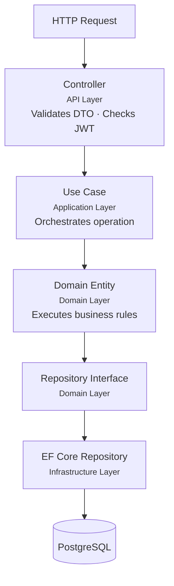
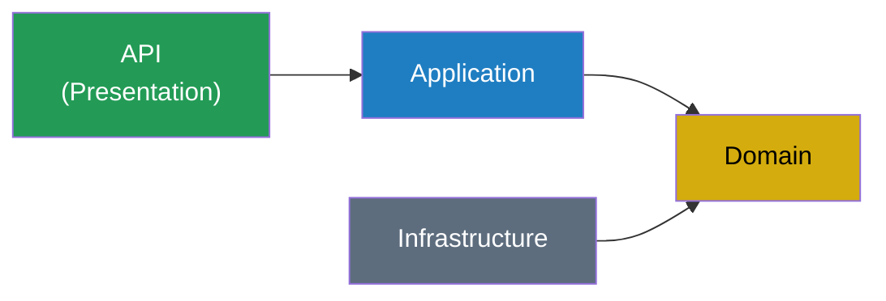

# Architecture Overview

## Style

**Modular Monolith with DDD** — organized by bounded context, with internal layering per project.

## Solution Structure

```
MechanicsSoftware.sln

src/
  MechanicsSoftware.Domain/
    Customers/
      Entities/Customer.cs
      ValueObjects/TaxId.cs
      ValueObjects/Email.cs
      Repositories/ICustomerRepository.cs
    Vehicles/
      Entities/Vehicle.cs
      ValueObjects/LicensePlate.cs
      Repositories/IVehicleRepository.cs
    ServiceOrders/
      Entities/ServiceOrder.cs
      Entities/ServiceItem.cs
      Entities/PartItem.cs
      Entities/Budget.cs
      ValueObjects/ServiceOrderStatus.cs
      Repositories/IServiceOrderRepository.cs
      Exceptions/InvalidStatusTransitionException.cs
    Inventory/
      Entities/Part.cs
      Entities/StockMovement.cs
      Repositories/IPartRepository.cs
    Shared/
      Entity.cs
      ValueObject.cs
      DomainException.cs
      Money.cs

  MechanicsSoftware.Application/
    Customers/
      UseCases/CreateCustomer/
        CreateCustomerUseCase.cs
        CreateCustomerInput.cs
        CreateCustomerOutput.cs
      UseCases/GetCustomerByDocument/
      UseCases/UpdateCustomer/
      UseCases/DeleteCustomer/
      UseCases/ListCustomers/
    Vehicles/        # same structure
    ServiceOrders/   # same structure + status transitions
    Inventory/       # same structure + stock operations
    Auth/
      UseCases/Login/

  MechanicsSoftware.Infrastructure/
    Persistence/
      AppDbContext.cs
      Migrations/
      Configurations/
        CustomerConfiguration.cs
        VehicleConfiguration.cs
        ServiceOrderConfiguration.cs
        PartConfiguration.cs
      Repositories/
        CustomerRepository.cs
        VehicleRepository.cs
        ServiceOrderRepository.cs
        PartRepository.cs
    Security/
      JwtProvider.cs
      PasswordHasher.cs

  MechanicsSoftware.API/
    Controllers/
      CustomersController.cs
      VehiclesController.cs
      ServicesController.cs
      PartsController.cs
      ServiceOrdersController.cs
      AuthController.cs
    DTOs/
    Middleware/
      ExceptionHandlingMiddleware.cs
    Extensions/
      SwaggerExtensions.cs
      AuthExtensions.cs
    Program.cs
    appsettings.json
    appsettings.Development.json

tests/
  MechanicsSoftware.UnitTests/
    Domain/
      Customers/
      ServiceOrders/
      Inventory/
    Application/
  MechanicsSoftware.IntegrationTests/
    Customers/
    ServiceOrders/
    Inventory/
```

## Request Flow



## Dependency Rule



- **Domain** has zero external dependencies (no EF Core, no ASP.NET)
- **Infrastructure** implements repository interfaces from Domain
- **Application** orchestrates use cases using Domain + repository interfaces
- **API** handles HTTP concerns and depends on Application

## API Endpoints

### Public (no JWT)
```
POST /api/auth/login
GET  /api/service-orders/{id}/status
```

### Protected (JWT required)
```
POST   /api/customers
GET    /api/customers
GET    /api/customers/{id}
PUT    /api/customers/{id}
DELETE /api/customers/{id}

POST   /api/vehicles
GET    /api/vehicles
GET    /api/vehicles/{id}
PUT    /api/vehicles/{id}
DELETE /api/vehicles/{id}

POST   /api/services
GET    /api/services
GET    /api/services/{id}
PUT    /api/services/{id}
DELETE /api/services/{id}

POST   /api/parts
GET    /api/parts
GET    /api/parts/{id}
PUT    /api/parts/{id}
DELETE /api/parts/{id}
PATCH  /api/parts/{id}/stock

POST   /api/service-orders
GET    /api/service-orders
GET    /api/service-orders/{id}
POST   /api/service-orders/{id}/services
POST   /api/service-orders/{id}/parts
POST   /api/service-orders/{id}/budget
POST   /api/service-orders/{id}/approve
POST   /api/service-orders/{id}/reject
POST   /api/service-orders/{id}/start-diagnosis
POST   /api/service-orders/{id}/start-execution
POST   /api/service-orders/{id}/complete
POST   /api/service-orders/{id}/deliver
GET    /api/service-orders/metrics/average-execution-time
```

## Infrastructure (docker-compose)

```
services:
  api:  ASP.NET Core 8 (port 8080)
  db:   PostgreSQL 16 (port 5432)

Swagger: available at /swagger
```

## Security

- JWT with configurable expiration via environment variables
- Passwords hashed with BCrypt
- CPF/CNPJ and license plate validation in Value Objects (not in DTOs)
- EF Core prevents SQL injection by design (parameterized queries)
- Global exception handling middleware
- Rate limiting via ASP.NET Core built-in rate limiter
