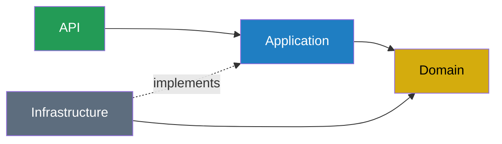
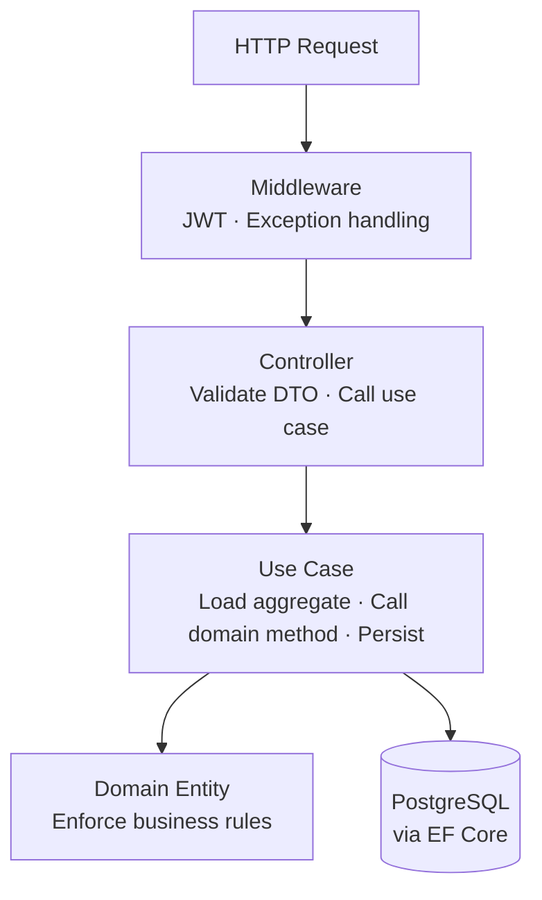

# Architecture Overview

## Style

**Vertical Slice Architecture + DDD Domain**

Features are organized by use case (vertical), not by technical type (horizontal). The Domain layer remains pure — no framework dependencies, business rules enforced by entities and value objects.

See [ADR-002](../decisions/ADR-002-architecture.md) for the full decision rationale.

## Solution Structure

```
MechanicsSoftware.sln

src/
  MechanicsSoftware.Domain/
    Customers/
      Customer.cs
      TaxId.cs
      Email.cs
    Vehicles/
      Vehicle.cs
      LicensePlate.cs
    ServiceOrders/
      ServiceOrder.cs               ← aggregate root + state machine
      ServiceOrderStatus.cs         ← value object with transition rules
      ServiceItem.cs
      PartItem.cs
      Budget.cs
      Exceptions/
        InvalidStatusTransitionException.cs
    Inventory/
      Part.cs
      StockMovement.cs
    Shared/
      Entity.cs
      ValueObject.cs
      DomainException.cs
      Money.cs

  MechanicsSoftware.Application/
    Features/
      Auth/
        Login/
          LoginUseCase.cs
          LoginRequest.cs
          LoginResponse.cs
      Customers/
        CreateCustomer/
          CreateCustomerUseCase.cs
          CreateCustomerRequest.cs
          CreateCustomerResponse.cs
        UpdateCustomer/ ...
        DeleteCustomer/ ...
        GetCustomer/    ...
        ListCustomers/  ...
      Vehicles/
        CreateVehicle/ ...
        UpdateVehicle/ ...
        DeleteVehicle/ ...
        GetVehicle/    ...
        ListVehicles/  ...
      Services/
        CreateService/ ...
        UpdateService/ ...
        DeleteService/ ...
        GetService/    ...
        ListServices/  ...
      Inventory/
        CreatePart/   ...
        UpdatePart/   ...
        DeletePart/   ...
        GetPart/      ...
        ListParts/    ...
        UpdateStock/  ...
      ServiceOrders/
        CreateServiceOrder/
        AddServiceItem/
        AddPartItem/
        GenerateBudget/
        SendBudget/
        StartDiagnosis/
        ApproveServiceOrder/
        RejectServiceOrder/
        StartExecution/
        CompleteServiceOrder/
        DeliverServiceOrder/
        GetServiceOrderStatus/   ← public endpoint (no JWT)
        GetServiceOrder/
        ListServiceOrders/
        GetAverageExecutionTime/
    Common/
      Interfaces/
        IAppDbContext.cs
      Exceptions/
        NotFoundException.cs

  MechanicsSoftware.Infrastructure/
    Persistence/
      AppDbContext.cs
      Configurations/
        CustomerConfiguration.cs
        VehicleConfiguration.cs
        ServiceOrderConfiguration.cs
        PartConfiguration.cs
      Migrations/
    Security/
      JwtProvider.cs
      PasswordHasher.cs

  MechanicsSoftware.API/
    Controllers/
      AuthController.cs
      CustomersController.cs
      VehiclesController.cs
      ServicesController.cs
      PartsController.cs
      ServiceOrdersController.cs
    Middleware/
      ExceptionHandlingMiddleware.cs
    Extensions/
      SwaggerExtensions.cs
      AuthExtensions.cs
      ApplicationExtensions.cs
    Program.cs
    appsettings.json
    appsettings.Development.json

tests/
  MechanicsSoftware.UnitTests/
    Domain/
      Customers/
        TaxIdTests.cs
        CustomerTests.cs
      Vehicles/
        LicensePlateTests.cs
      ServiceOrders/
        ServiceOrderStatusTests.cs
        ServiceOrderTests.cs
        BudgetTests.cs
      Inventory/
        PartStockTests.cs
    Application/
      ServiceOrders/
        CreateServiceOrderUseCaseTests.cs
        ApproveServiceOrderUseCaseTests.cs
        ...
  MechanicsSoftware.IntegrationTests/
    Customers/
      CustomersEndpointsTests.cs
    ServiceOrders/
      ServiceOrderFlowTests.cs
    Inventory/
      InventoryEndpointsTests.cs
```

## Layer Dependency Rule



- **Domain** — zero external dependencies. Business rules live here.
- **Application** — use cases. Loads aggregates via `IAppDbContext` (interface defined here), calls domain methods, persists.
- **Infrastructure** — implements `IAppDbContext` with EF Core (dependency inversion). Owns migrations and security utilities. Depends on Application, not the other way around.
- **API** — thin controllers. Dispatches to use cases. Owns DI wiring, middleware, Swagger.

## Request Flow



## Use Case Pattern

```csharp
// Each use case is a plain C# class — no base class, no framework
public class StartDiagnosisUseCase(IAppDbContext db)
{
    public async Task<StartDiagnosisResponse> HandleAsync(
        Guid serviceOrderId, CancellationToken ct = default)
    {
        var order = await db.ServiceOrders
            .Include(o => o.Items)
            .FirstOrDefaultAsync(o => o.Id == serviceOrderId, ct)
            ?? throw new NotFoundException(nameof(ServiceOrder), serviceOrderId);

        order.StartDiagnosis(); // domain enforces the transition

        await db.SaveChangesAsync(ct);

        return new StartDiagnosisResponse(order.Id, order.Status);
    }
}
```

## Controller Pattern

```csharp
// Thin controller — only HTTP concerns
[ApiController]
[Route("api/service-orders")]
[Authorize]
public class ServiceOrdersController(
    CreateServiceOrderUseCase create,
    StartDiagnosisUseCase startDiagnosis) : ControllerBase
{
    [HttpPost]
    public async Task<IActionResult> Create(CreateServiceOrderRequest request)
    {
        var result = await create.HandleAsync(request);
        return CreatedAtAction(nameof(Get), new { id = result.Id }, result);
    }

    [HttpPost("{id}/start-diagnosis")]
    public async Task<IActionResult> StartDiagnosis(Guid id)
    {
        var result = await startDiagnosis.HandleAsync(id);
        return Ok(result);
    }
}
```

## API Endpoints

### Public (no JWT)
```
POST /api/auth/login
GET  /api/service-orders/{id}/status
```

### Protected (JWT required)
```
POST/GET/PUT/DELETE  /api/customers
POST/GET/PUT/DELETE  /api/vehicles
POST/GET/PUT/DELETE  /api/services
POST/GET/PUT/DELETE  /api/parts
PATCH                /api/parts/{id}/stock

POST   /api/service-orders
GET    /api/service-orders
GET    /api/service-orders/{id}
POST   /api/service-orders/{id}/services
POST   /api/service-orders/{id}/parts
POST   /api/service-orders/{id}/budget
POST   /api/service-orders/{id}/approve
POST   /api/service-orders/{id}/reject
POST   /api/service-orders/{id}/start-diagnosis
POST   /api/service-orders/{id}/start-execution
POST   /api/service-orders/{id}/complete
POST   /api/service-orders/{id}/deliver
GET    /api/service-orders/metrics/average-execution-time
```

## Infrastructure (docker-compose)

```
services:
  api: ASP.NET Core 8 (port 8080)
  db:  PostgreSQL 16 (port 5432)

Swagger: /swagger
```

## Security

- JWT with configurable expiration via ENV
- Passwords hashed with BCrypt
- CPF/CNPJ and plate validation in Value Objects (not in DTOs)
- EF Core parameterized queries prevent SQL injection
- Global exception middleware — no stack traces in production responses
- ASP.NET Core built-in rate limiter
