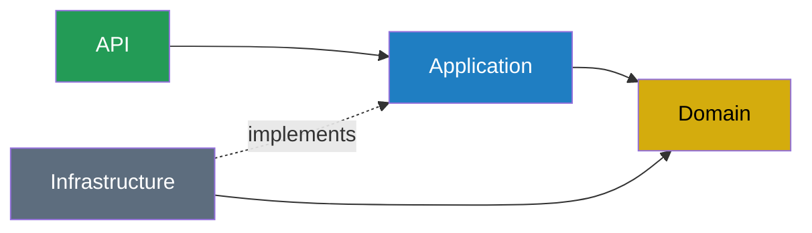

# ADR-002: Vertical Slice Architecture + DDD Domain

**Status:** Accepted
**Date:** 2026-03-07

## Context

The challenge requires a monolithic backend with DDD applied. The initial approach was a classic horizontal layered architecture (Domain / Application / Infrastructure / API). After review, this approach creates unnecessary friction for an MVP: every new feature touches multiple projects and layers, and the repository abstraction adds boilerplate without real benefit at this scale.

## Decision

Adopt **Vertical Slice Architecture (VSA)** for the application layer, combined with a **pure DDD Domain project**.

No MediatR. Use cases are plain C# classes.

### Project structure

```
src/
  MechanicsSoftware.Domain/         ← Pure domain: entities, value objects, exceptions
  MechanicsSoftware.Application/    ← Features organized vertically by use case
  MechanicsSoftware.Infrastructure/ ← EF Core, JWT, BCrypt
  MechanicsSoftware.API/            ← Controllers, middleware, DI, Swagger

tests/
  MechanicsSoftware.UnitTests/      ← Domain logic, use cases (no DB)
  MechanicsSoftware.IntegrationTests/ ← Full HTTP flow with test DB
```

### Feature folder structure (inside Application)

```
Application/
  Features/
    ServiceOrders/
      CreateServiceOrder/
        CreateServiceOrderUseCase.cs
        CreateServiceOrderRequest.cs
        CreateServiceOrderResponse.cs
      StartDiagnosis/
        StartDiagnosisUseCase.cs
        StartDiagnosisRequest.cs
      ApproveServiceOrder/
        ...
    Customers/
      CreateCustomer/
        CreateCustomerUseCase.cs
        CreateCustomerRequest.cs
        CreateCustomerResponse.cs
      ...
    Vehicles/  ...
    Inventory/ ...
    Auth/      ...
  Common/
    Interfaces/
      IAppDbContext.cs
    Exceptions/
      NotFoundException.cs
```

### Use case pattern (plain class, no MediatR)

```csharp
public class CreateServiceOrderUseCase(IAppDbContext db)
{
    public async Task<CreateServiceOrderResponse> HandleAsync(
        CreateServiceOrderRequest request,
        CancellationToken ct = default)
    {
        var customer = await db.Customers.FindAsync(request.CustomerId, ct)
            ?? throw new NotFoundException(nameof(Customer), request.CustomerId);

        var vehicle = await db.Vehicles.FindAsync(request.VehicleId, ct)
            ?? throw new NotFoundException(nameof(Vehicle), request.VehicleId);

        var order = ServiceOrder.Create(customer, vehicle);

        db.ServiceOrders.Add(order);
        await db.SaveChangesAsync(ct);

        return new CreateServiceOrderResponse(order.Id, order.Status);
    }
}
```

### Controller (thin — dispatch only)

```csharp
[ApiController]
[Route("api/service-orders")]
public class ServiceOrdersController(CreateServiceOrderUseCase createUseCase) : ControllerBase
{
    [HttpPost]
    public async Task<IActionResult> Create(CreateServiceOrderRequest request)
    {
        var result = await createUseCase.HandleAsync(request);
        return CreatedAtAction(nameof(Get), new { id = result.Id }, result);
    }
}
```

## Layer dependency rule



- **Domain** — zero framework dependencies. Pure C# classes with business rules.
- **Application** — use cases define and reference `IAppDbContext` (interface). Loads domain aggregates, calls domain methods, persists. Does NOT depend on Infrastructure.
- **Infrastructure** — implements `IAppDbContext` via EF Core `AppDbContext` (dependency inversion). Infrastructure depends on Application, not vice versa. Owns migrations.
- **API** — registers DI (wires `IAppDbContext` → `AppDbContext`), exposes HTTP, handles middleware (JWT, exceptions, Swagger).

## Why no repository pattern

- `IAppDbContext` gives a testable seam without per-aggregate repository interfaces
- EF Core `DbSet<T>` is already a repository — abstracting it again adds no value
- Domain entities enforce their own invariants; handlers just load, call, and save
- Reduces boilerplate significantly for an MVP

## Why no MediatR

- VSA doesn't require MediatR — it's optional infrastructure
- Plain use case classes are explicit, simpler to trace, and easier to explain
- Cross-cutting concerns (logging, validation) handled by ASP.NET middleware and FluentValidation in the use case
- Fewer dependencies, lower cognitive overhead

## How this satisfies the challenge requirements

| Requirement | How it's met |
|---|---|
| DDD | Domain project with entities, value objects, aggregates, domain exceptions |
| Monolith in layers | 4 projects: Domain → Application → Infrastructure → API |
| Clear separation | Each use case is self-contained and independently testable |
| 80% test coverage | Unit tests on domain; integration tests on use cases with test DB |
| Swagger | Thin controllers with explicit request/response types |

## Consequences

### IAppDbContext trade-off

`IAppDbContext` exposes the full database surface to all use cases — a `CreateCustomerUseCase` has nothing technically preventing it from touching `db.ServiceOrders`. This is an acceptable trade-off for Phase 1 (MVP scope, small team, clear discipline). If the codebase grows, consider splitting into context-scoped interfaces (`ICustomersDbContext`, `IInventoryDbContext`, etc.) to enforce slice boundaries.

## Alternatives considered

| Alternative | Reason not chosen |
|---|---|
| Classic horizontal layers | Feature changes touch many files across many layers; more boilerplate |
| MediatR + VSA | MediatR adds a dispatch layer with no benefit for this scale |
| MediatR + CQRS | Over-engineered for an MVP; same outcome achievable with plain classes |
