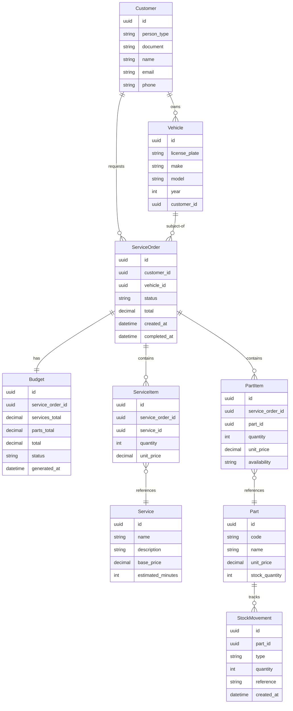

# Aggregates, Entities and Value Objects

## Entity Relationship Diagram



## Aggregate Roots

### ServiceOrder (Main Aggregate Root)

The most complex aggregate in the system. Encapsulates all business rules for the OS lifecycle.

**Responsibilities:**
- Manage addition of services and parts
- Calculate and generate the budget
- Control status transitions (state machine)
- Enforce business invariants

**Child entities:**
- `ServiceItem` — a service added to the OS
- `PartItem` — a part added to the OS
- `Budget` — the calculated value sent for approval

**Invariant rules:**
- Cannot add items to an OS with status other than `IN_DIAGNOSIS`
- Cannot start execution without an approved budget
- Status can only advance according to the defined state machine
- Budget total includes only `AVAILABLE` items

---

### Customer (Aggregate Root)

**Attributes:**
- `id` — UUID
- `personType` — `INDIVIDUAL` | `COMPANY`
- `document` — Value Object `TaxId` (CPF or CNPJ)
- `name` — string
- `email` — Value Object `Email`
- `phone` — string

**Rules:**
- `document` must be unique per customer
- `personType` determines the document validation format

---

### Vehicle (Aggregate Root)

**Attributes:**
- `id` — UUID
- `licensePlate` — Value Object `LicensePlate`
- `make` — string
- `model` — string
- `year` — number
- `customerId` — reference to Customer

**Rules:**
- `licensePlate` must be unique in the system
- `1886 <= year <= currentYear + 1` (1886: year of the first automobile)

---

### Part (Aggregate Root — Inventory context)

**Attributes:**
- `id` — UUID
- `code` — unique string
- `name` — string
- `description` — string
- `unitPrice` — Value Object `Money`
- `stockQuantity` — number

**Child entities:**
- `StockMovement`

**Rules:**
- Stock cannot go negative
- Every quantity change generates a `StockMovement`

---

### Service (Aggregate Root — catalog)

**Attributes:**
- `id` — UUID
- `name` — string
- `description` — string
- `basePrice` — Value Object `Money`
- `estimatedMinutes` — number

**Rules:**
- `name` must be unique in the catalogue
- `basePrice` cannot be negative
- `estimatedMinutes` must be positive
- Price changes do not retroactively affect existing `ServiceItem` records (price is snapshotted at OS composition time)

---

## Value Objects

### TaxId

```
type: 'CPF' | 'CNPJ'
value: string (digits only)

Validations:
- CPF:  11 digits, check digit algorithm
- CNPJ: 14 digits, check digit algorithm
```

### LicensePlate

```
value: string

Accepted formats:
- Mercosul: ABC1D23  (3 letters, 1 digit, 1 letter, 2 digits)
- Legacy:   ABC1234  (3 letters, 4 digits)
```

### Money

```
amount: number (in cents — integer)
currency: 'BRL'

Operations:
- add(other: Money): Money
- multiply(factor: number): Money
- toFormatted(): string   ("R$ 150,00")
```

Using cents avoids floating point errors.

### Email

```
value: string
Validation: simplified RFC 5322 format
```

### ServiceOrderStatus

```
Enum with valid transitions encapsulated.
Throws InvalidStatusTransitionException for invalid transitions.
```

### BudgetStatus

```
Enum: PENDING | APPROVED | REJECTED

Valid transitions:
  PENDING → APPROVED  (customer approves)
  PENDING → REJECTED  (customer rejects)

APPROVED and REJECTED are terminal — no further transitions allowed.
Throws DomainException for invalid transitions.
```

---

## Entities (non-Aggregate Root)

### ServiceItem
```
id
serviceOrderId
serviceId
quantity
unitPrice  (price snapshot at the time of addition)
```

### PartItem
```
id
serviceOrderId
partId
quantity
unitPrice     (price snapshot at the time of addition)
availability  AVAILABLE | UNAVAILABLE
              AVAILABLE:   stock was sufficient at addition time; reserved in inventory
              UNAVAILABLE: insufficient stock; attendant alerted; excluded from budget total
```

### Budget
```
id
serviceOrderId
servicesTotal: Money
partsTotal:    Money
total:         Money
status:        BudgetStatus (Value Object — see Value Objects section)
generatedAt:   Date
```
Budget is a child entity of ServiceOrder — it has no independent lifecycle.
The Generate Budget command is handled by ServiceOrder, which creates the Budget internally.

### StockMovement
```
id
partId
type:      'INBOUND' | 'OUTBOUND' | 'RESERVATION' | 'RELEASE'
quantity:  number
reference: string  (e.g. service order number)
createdAt: Date
```
