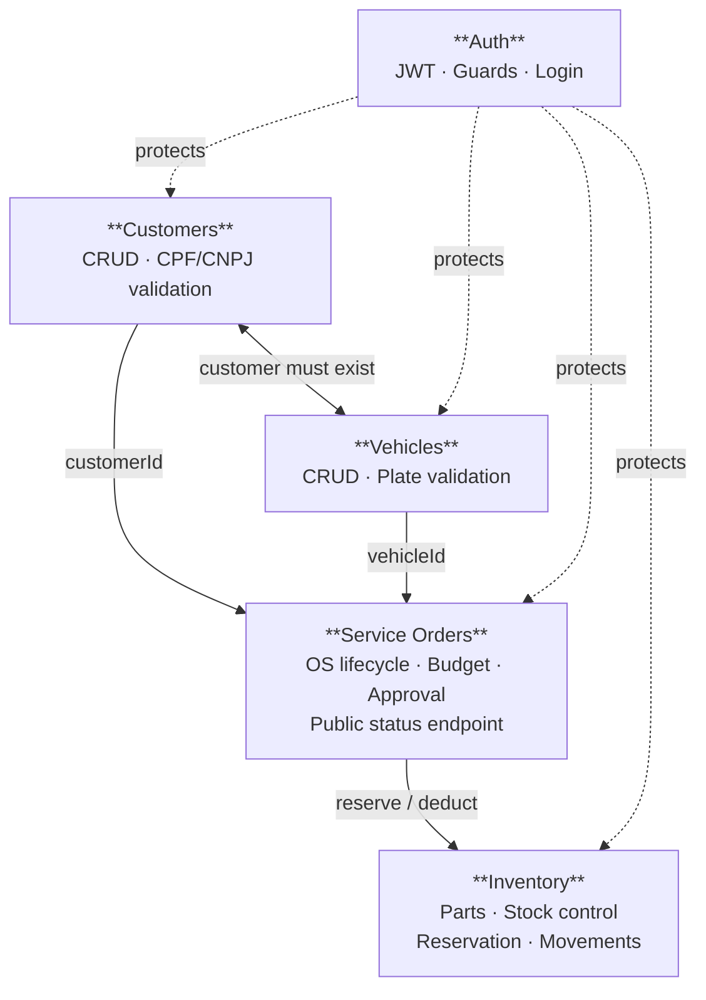

# Bounded Contexts

## Context Map

## Context Descriptions

### Customers
- **Core:** `Customer`
- **Operations:** CRUD, search by CPF/CNPJ
- **Validations:** CPF algorithm, CNPJ algorithm
- **Exposes:** `customerId` to other contexts

### Vehicles
- **Core:** `Vehicle`
- **Operations:** CRUD, search by license plate
- **Upstream dependency:** Customers (customer must exist)
- **Validations:** Mercosul and legacy plate formats

### Service Orders
- **Core:** `ServiceOrder` + `Budget`
- **Operations:** creation, item management, state machine, approval
- **Upstream dependencies:** Customers, Vehicles, Inventory
- **Exposes:** public status endpoint (no JWT required)

### Inventory
- **Core:** `Part` + `StockMovement`
- **Operations:** CRUD parts, stock control, reservation, deduction
- **Called by:** Service Orders (when adding a part to OS and confirming usage)

### Auth
- **Core:** `User` + JWT
- **Operations:** login, token issuance
- **Protects:** all admin routes across every other context
- **Public route:** `GET /service-orders/:id/status` (customer status query)

## Context Relationships

| Relationship | Type | Description |
|---|---|---|
| Vehicles → Customers | Conformist | Vehicle uses `customerId`; does not enforce Customer rules |
| Service Orders → Customers | Anti-Corruption Layer | OS validates customer existence before creation |
| Service Orders → Vehicles | Anti-Corruption Layer | OS validates vehicle existence before creation |
| Service Orders → Inventory | Customer/Supplier | OS requests stock reservation; Inventory is the supplier |
| Auth → all | Open Host Service | JWT Guard applied via decorator across all modules |
