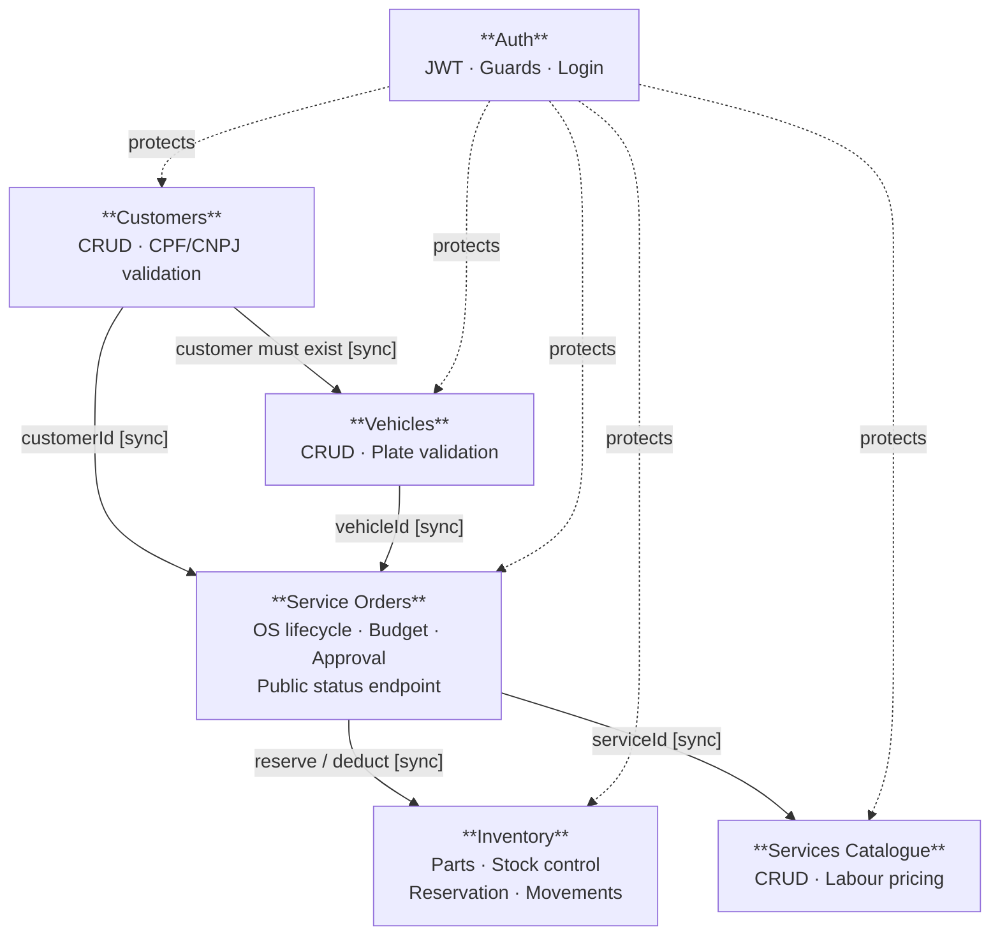

# Bounded Contexts

## Context Map

> **Legend:** Solid arrows = synchronous call. Dashed arrows = cross-cutting concern (Auth guard).
> All integration in this monolith is synchronous — no message bus at this phase.

## Context Descriptions

### Customers
- **Core:** `Customer`
- **Operations:** CRUD, search by CPF/CNPJ
- **Validations:** CPF algorithm, CNPJ algorithm
- **Exposes:** `customerId` to other contexts

### Vehicles
- **Core:** `Vehicle`
- **Operations:** CRUD, search by license plate
- **Upstream dependency:** Customers — validates customer existence before persisting a vehicle (Customer/Supplier relationship)
- **Validations:** Mercosul and legacy plate formats

### Services Catalogue
- **Core:** `Service`
- **Operations:** CRUD (name, description, base price, estimated duration)
- **Consumed by:** Service Orders — when adding a service item to an OS, the price is snapshotted from here
- **Note:** Price changes in the catalogue do not retroactively affect existing OS items

### Service Orders
- **Core:** `ServiceOrder` + `Budget` (Budget is a child entity of ServiceOrder)
- **Operations:** creation, item management, state machine, approval
- **Upstream dependencies:** Customers, Vehicles, Inventory
- **Exposes:** public status endpoint (no JWT required)

### Inventory
- **Core:** `Part` + `StockMovement`
- **Operations:** CRUD parts, stock control, reservation, deduction
- **Called by:** Service Orders (when adding a part to OS and confirming usage)

### Auth
- **Core:** `User` + JWT
- **Operations:** login, token issuance
- **Protects:** all admin routes across every other context
- **Public route:** `GET /service-orders/:id/status` (customer status query)

## Context Relationships

| Relationship | Type | Description |
|---|---|---|
| Vehicles → Customers | Customer/Supplier | Vehicles (customer) validates customer existence via Customers context (supplier) before persisting a vehicle |
| Service Orders → Customers | Anti-Corruption Layer | OS validates customer existence before creation |
| Service Orders → Vehicles | Anti-Corruption Layer | OS validates vehicle existence before creation |
| Service Orders → Services Catalogue | Customer/Supplier | OS (customer) reads service pricing from Services Catalogue (supplier); snapshots price at composition time |
| Service Orders → Inventory | Customer/Supplier | OS requests stock reservation and deduction; Inventory is the supplier |
| Auth → all | Open Host Service | JWT Guard applied via decorator across all contexts |
