# Domain Storytelling — Mechanics Software

Domain Storytelling captures how the business works through stories told by domain experts. Each story follows the notation:

```
[Actor] → [verb] → [work object] → (to/at/in) [actor or system]
```

**Rules applied here:**
- Each story is a single, linear flow — one scenario, no branching
- If a condition creates a different outcome, it becomes a separate story
- Loops (repetition) are allowed; conditionals are not

Stories are numbered step-by-step and accompanied by a sequence diagram.

---

## Story 1 — Existing Customer Identification

**Scenario:** A customer arrives at the shop. The attendant searches and finds the customer already registered.

### Steps

```
1. Customer      → arrives at          → Shop (with Vehicle)     → at Attendant
2. Attendant     → searches for        → Customer (by CPF/CNPJ)  → in System
3. System        → returns             → Customer record          → to Attendant
4. Attendant     → confirms            → Customer identity        → with Customer
```

### Sequence Diagram

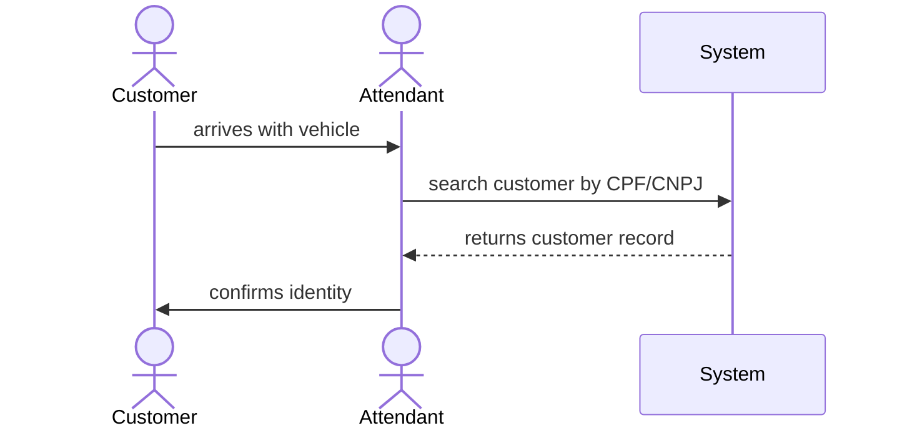
```mermaid
sequenceDiagram
    actor Customer
    actor Attendant
    participant System

    Customer->>Attendant: arrives with vehicle
    Attendant->>System: search customer by CPF/CNPJ
    System-->>Attendant: returns customer record
    Attendant->>Customer: confirms identity
```

---

## Story 2 — New Customer Registration

**Scenario:** A customer arrives at the shop. The attendant searches and does not find the customer — registers a new one.

### Steps

```
1. Customer      → arrives at          → Shop (with Vehicle)     → at Attendant
2. Attendant     → searches for        → Customer (by CPF/CNPJ)  → in System
3. System        → returns             → not found               → to Attendant
4. Attendant     → registers           → Customer data           → in System
5. System        → validates           → CPF / CNPJ              → (check digit algorithm)
6. System        → saves               → Customer                → in Database
7. System        → confirms            → Customer registration   → to Attendant
```

### Sequence Diagram

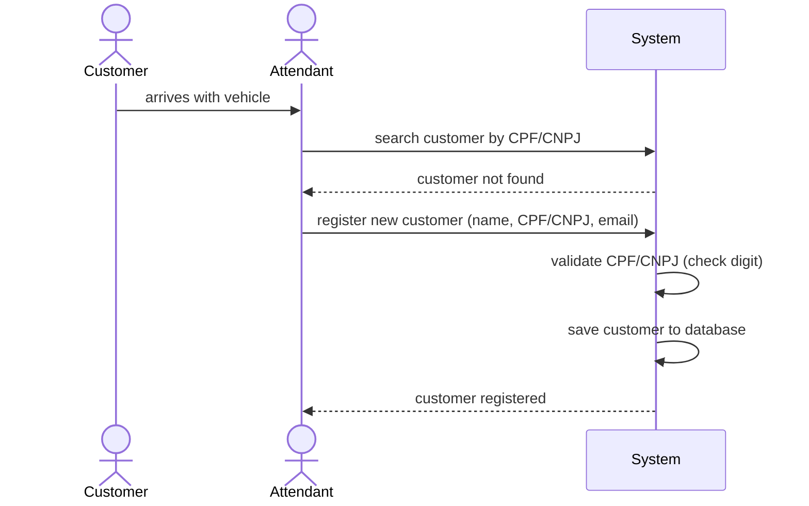
```mermaid
sequenceDiagram
    actor Customer
    actor Attendant
    participant System

    Customer->>Attendant: arrives with vehicle
    Attendant->>System: search customer by CPF/CNPJ
    System-->>Attendant: customer not found
    Attendant->>System: register new customer (name, CPF/CNPJ, email)
    System->>System: validate CPF/CNPJ (check digit)
    System->>System: save customer to database
    System-->>Attendant: customer registered
```

---

## Story 3 — Existing Vehicle Identification

**Scenario:** After identifying the customer, the attendant searches and finds the vehicle already registered.

### Steps

```
1. Attendant     → searches for        → Vehicle (by license plate) → in System
2. System        → returns             → Vehicle record              → to Attendant
3. Attendant     → confirms            → Vehicle details             → with Customer
```

### Sequence Diagram

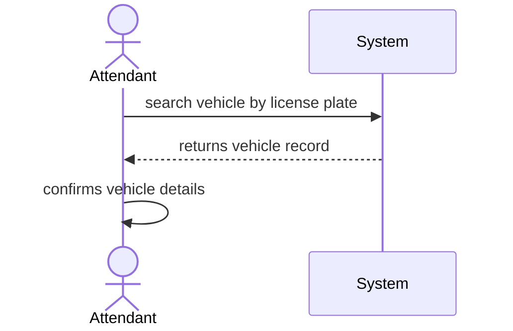
```mermaid
sequenceDiagram
    actor Attendant
    participant System

    Attendant->>System: search vehicle by license plate
    System-->>Attendant: returns vehicle record
    Attendant->>Attendant: confirms vehicle details
```

---

## Story 4 — New Vehicle Registration

**Scenario:** The attendant searches for the vehicle and does not find it — registers a new one linked to the customer.

### Steps

```
1. Attendant     → searches for        → Vehicle (by license plate) → in System
2. System        → returns             → not found                   → to Attendant
3. Attendant     → registers           → Vehicle data                → in System
4. System        → validates           → License plate format        → (Mercosul / legacy)
5. System        → links               → Vehicle                     → to Customer
6. System        → saves               → Vehicle                     → in Database
7. System        → confirms            → Vehicle registration        → to Attendant
```

### Sequence Diagram

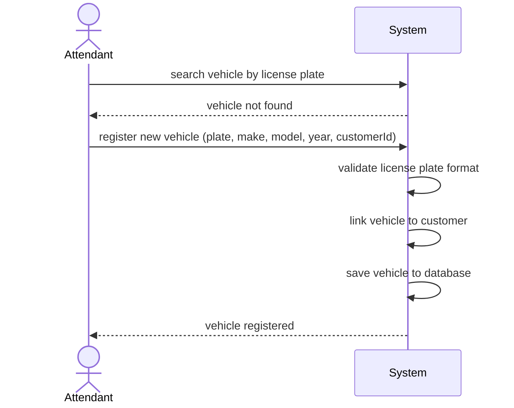
```mermaid
sequenceDiagram
    actor Attendant
    participant System

    Attendant->>System: search vehicle by license plate
    System-->>Attendant: vehicle not found
    Attendant->>System: register new vehicle (plate, make, model, year, customerId)
    System->>System: validate license plate format
    System->>System: link vehicle to customer
    System->>System: save vehicle to database
    System-->>Attendant: vehicle registered
```

---

## Story 5 — Service Order Creation and Diagnosis

**Scenario:** With customer and vehicle identified, the attendant opens a service order. The mechanic starts diagnosis and then adds services and parts. All parts have sufficient stock.

### Steps

```
1. Attendant     → opens               → Service Order              → in System
2. System        → creates             → Service Order              → with status RECEIVED
3. System        → links               → Customer + Vehicle         → to Service Order
4. System        → confirms            → Service Order created      → to Attendant
5. Attendant     → hands over          → Vehicle                    → to Mechanic
6. Mechanic      → starts              → Diagnosis                  → in System
7. System        → transitions         → Service Order status        → to IN_DIAGNOSIS
8. Mechanic      → adds                → Service                    → to Service Order
9. System        → records             → Service item               → in Service Order
10. Mechanic     → adds                → Part                       → to Service Order
11. System       → checks              → Stock availability          → for Part
12. System       → reserves            → Part quantity              → in Stock
13. System       → records             → Stock Movement (RESERVATION) → in Database
14. System       → confirms            → Part added (AVAILABLE)     → to Mechanic
```

### Sequence Diagram

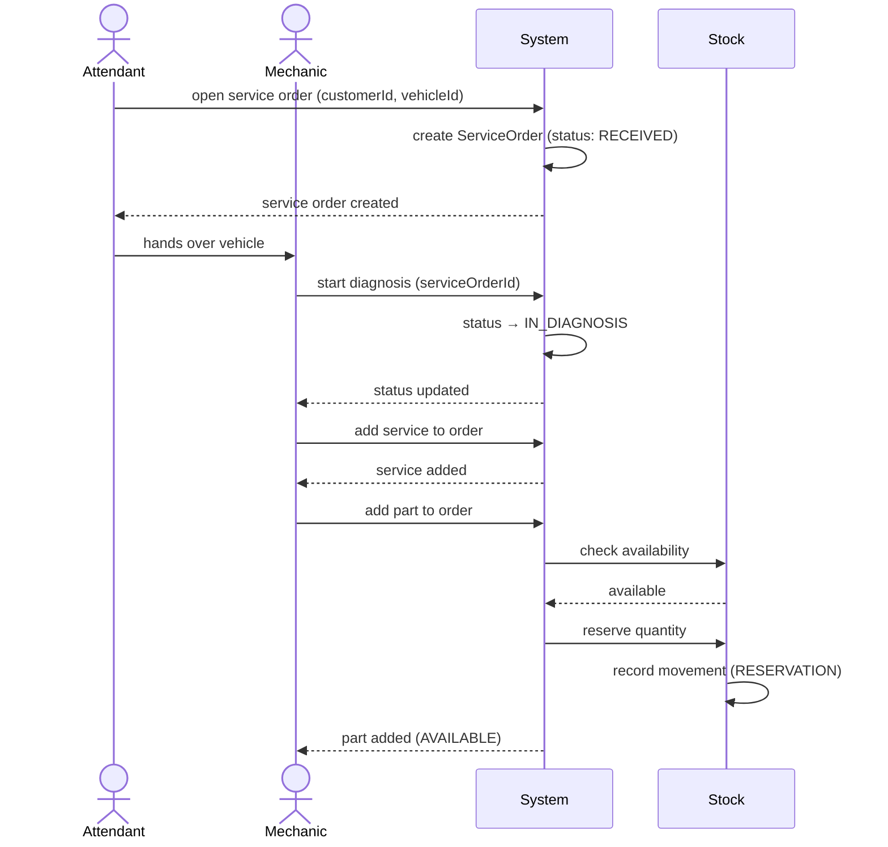
```mermaid
sequenceDiagram
    actor Attendant
    actor Mechanic
    participant System
    participant Stock

    Attendant->>System: open service order (customerId, vehicleId)
    System->>System: create ServiceOrder (status: RECEIVED)
    System-->>Attendant: service order created

    Attendant->>Mechanic: hands over vehicle
    Mechanic->>System: start diagnosis (serviceOrderId)
    System->>System: status → IN_DIAGNOSIS
    System-->>Mechanic: status updated

    Mechanic->>System: add service to order
    System-->>Mechanic: service added

    Mechanic->>System: add part to order
    System->>Stock: check availability
    Stock-->>System: available
    System->>Stock: reserve quantity
    Stock->>Stock: record movement (RESERVATION)
    System-->>Mechanic: part added (AVAILABLE)
```

---

## Story 6 — Part Added with Insufficient Stock

**Scenario:** The mechanic tries to add a part to a service order but the stock is insufficient. The part is added as UNAVAILABLE — it is recorded on the order but excluded from the budget total. The attendant is alerted.

### Steps

```
1. Mechanic      → adds                → Part                       → to Service Order
2. System        → checks              → Stock availability          → for Part
3. System        → adds                → Part (UNAVAILABLE)         → to Service Order
4. System        → alerts              → Attendant                  → about missing stock
5. System        → confirms            → Part added as UNAVAILABLE  → to Mechanic
```

> **Note:** No stock reservation is made for UNAVAILABLE parts. The part appears on the
> budget for transparency but is excluded from the total. The customer decides at
> approval time whether to proceed without the unavailable part.

### Sequence Diagram

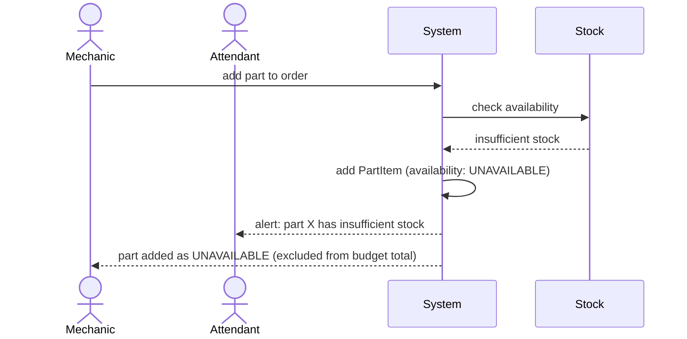
```mermaid
sequenceDiagram
    actor Mechanic
    actor Attendant
    participant System
    participant Stock

    Mechanic->>System: add part to order
    System->>Stock: check availability
    Stock-->>System: insufficient stock
    System->>System: add PartItem (availability: UNAVAILABLE)
    System-->>Attendant: alert: part X has insufficient stock
    System-->>Mechanic: part added as UNAVAILABLE (excluded from budget total)
```

---

## Story 7 — Diagnosis

**Scenario:** A mechanic receives the vehicle and begins the technical evaluation. No new items are discovered during diagnosis.

### Steps

```
1. Attendant     → hands over          → Vehicle                    → to Mechanic
2. Mechanic      → starts              → Diagnosis                  → in System
3. System        → validates           → Transition RECEIVED → IN_DIAGNOSIS
4. System        → transitions         → Service Order status        → to IN_DIAGNOSIS
5. System        → confirms            → Status updated             → to Mechanic
```

### Sequence Diagram

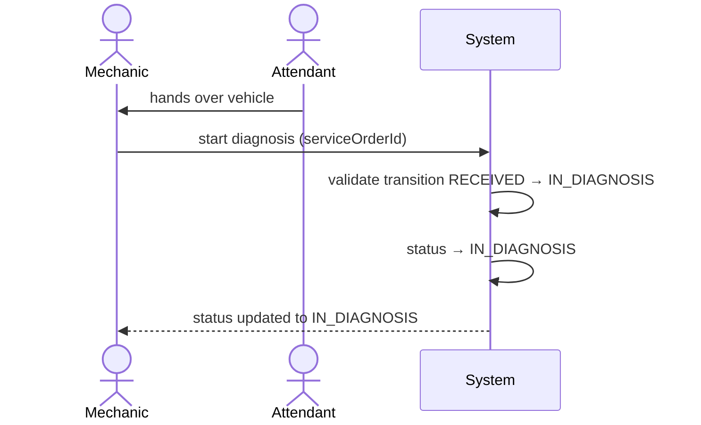
```mermaid
sequenceDiagram
    actor Mechanic
    actor Attendant
    participant System

    Attendant->>Mechanic: hands over vehicle
    Mechanic->>System: start diagnosis (serviceOrderId)
    System->>System: validate transition RECEIVED → IN_DIAGNOSIS
    System->>System: status → IN_DIAGNOSIS
    System-->>Mechanic: status updated to IN_DIAGNOSIS
```

---

## Story 8 — Diagnosis with Additional Items Discovered

**Scenario:** During diagnosis, the mechanic discovers new issues and adds extra services and parts to the service order.

### Steps

```
1. Attendant     → hands over          → Vehicle                    → to Mechanic
2. Mechanic      → starts              → Diagnosis                  → in System
3. System        → transitions         → Service Order status        → to IN_DIAGNOSIS
4. Mechanic      → evaluates           → Vehicle                    → physically
5. Mechanic      → adds                → additional Service          → to Service Order
6. System        → records             → Service item               → in Service Order
7. Mechanic      → adds                → additional Part             → to Service Order
8. System        → reserves            → Part quantity              → in Stock
9. System        → records             → Stock Movement (RESERVATION) → in Database
```

### Sequence Diagram

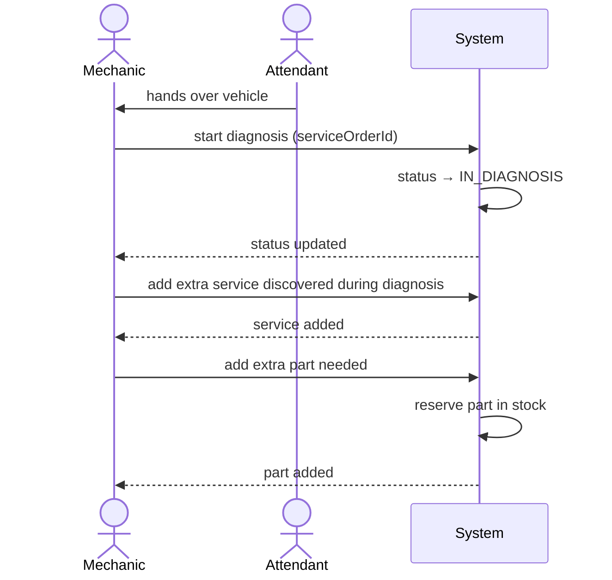
```mermaid
sequenceDiagram
    actor Mechanic
    actor Attendant
    participant System

    Attendant->>Mechanic: hands over vehicle
    Mechanic->>System: start diagnosis (serviceOrderId)
    System->>System: status → IN_DIAGNOSIS
    System-->>Mechanic: status updated

    Mechanic->>System: add extra service discovered during diagnosis
    System-->>Mechanic: service added

    Mechanic->>System: add extra part needed
    System->>System: reserve part in stock
    System-->>Mechanic: part added
```

---

## Story 8b — Diagnosis Closed, Budget Requested

**Scenario:** The mechanic finishes the diagnosis and notifies the attendant. The attendant generates and sends the budget, transitioning the order to AWAITING_APPROVAL.

### Steps

```
1. Mechanic      → notifies            → Attendant                  → that diagnosis is complete
2. Attendant     → requests            → Budget generation          → from System
3. System        → validates           → OS has at least one service → (business rule)
4. System        → calculates          → Budget total               → from services + parts prices
5. System        → creates             → Budget                     → as child of Service Order
6. Attendant     → sends               → Budget                     → to Customer (via API)
7. System        → transitions         → Service Order status        → to AWAITING_APPROVAL
```

### Sequence Diagram

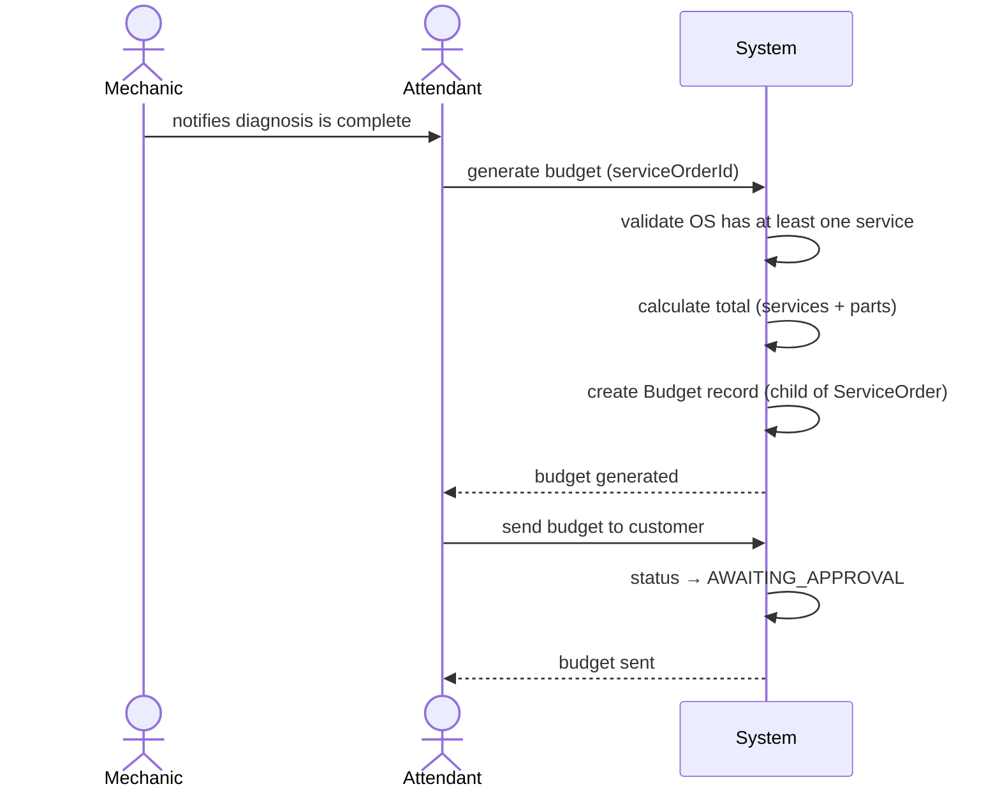
```mermaid
sequenceDiagram
    actor Mechanic
    actor Attendant
    participant System

    Mechanic->>Attendant: notifies diagnosis is complete
    Attendant->>System: generate budget (serviceOrderId)
    System->>System: validate OS has at least one service
    System->>System: calculate total (services + parts)
    System->>System: create Budget record (child of ServiceOrder)
    System-->>Attendant: budget generated

    Attendant->>System: send budget to customer
    System->>System: status → AWAITING_APPROVAL
    System-->>Attendant: budget sent
```

---

## Story 9 — Budget Generation and Sending

**Scenario:** After diagnosis, the attendant requests the budget. The system calculates and sends it to the customer.

### Steps

```
1. Attendant     → requests            → Budget generation          → from System
2. System        → calculates          → Budget total               → from services + parts prices
3. System        → creates             → Budget record              → in Database
4. System        → confirms            → Budget generated           → to Attendant
5. Attendant     → sends               → Budget                     → to Customer (via API)
6. System        → transitions         → Service Order status        → to AWAITING_APPROVAL
7. System        → notifies            → Customer                   → about Budget
```

### Sequence Diagram

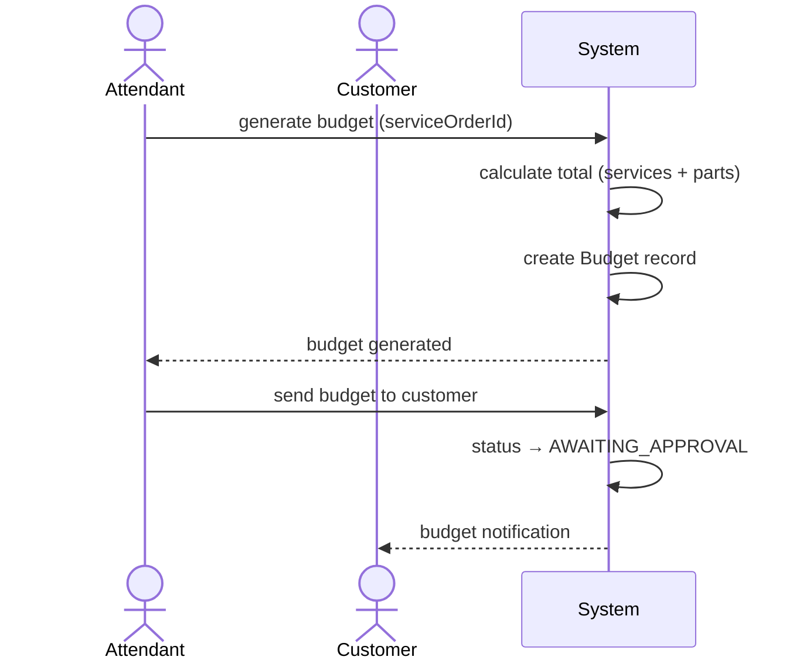
```mermaid
sequenceDiagram
    actor Attendant
    actor Customer
    participant System

    Attendant->>System: generate budget (serviceOrderId)
    System->>System: calculate total (services + parts)
    System->>System: create Budget record
    System-->>Attendant: budget generated

    Attendant->>System: send budget to customer
    System->>System: status → AWAITING_APPROVAL
    System-->>Customer: budget notification
```

---

## Story 10 — Budget Approval

**Scenario:** The customer reviews the budget and approves it. Services proceed to execution.

### Steps

```
1. Customer      → reviews             → Budget                     → via API
2. Customer      → approves            → Budget                     → via API
3. System        → validates           → Transition AWAITING_APPROVAL → IN_EXECUTION
4. System        → transitions         → Service Order status        → to IN_EXECUTION
5. System        → confirms            → Approval registered        → to Customer
```

### Sequence Diagram

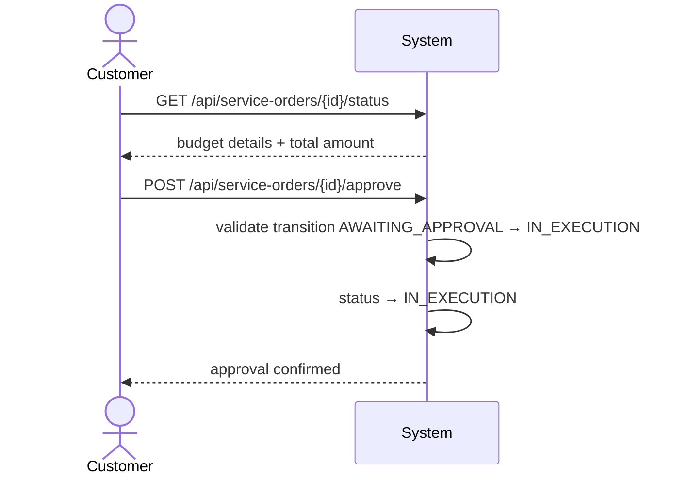
```mermaid
sequenceDiagram
    actor Customer
    participant System

    Customer->>System: GET /api/service-orders/{id}/status
    System-->>Customer: budget details + total amount

    Customer->>System: POST /api/service-orders/{id}/approve
    System->>System: validate transition AWAITING_APPROVAL → IN_EXECUTION
    System->>System: status → IN_EXECUTION
    System-->>Customer: approval confirmed
```

---

## Story 11 — Budget Rejection and Cancellation

**Scenario:** The customer reviews the budget and rejects it. The service order is cancelled and stock reservations are released.

### Steps

```
1. Customer      → reviews             → Budget                     → via API
2. Customer      → rejects             → Budget                     → via API
3. System        → validates           → Transition AWAITING_APPROVAL → CANCELLED
4. System        → transitions         → Service Order status        → to CANCELLED
5. System        → releases            → all Part reservations      → in Stock
6. System        → records             → Stock Movements (RELEASE)  → in Database
7. System        → confirms            → Cancellation               → to Customer
```

### Sequence Diagram

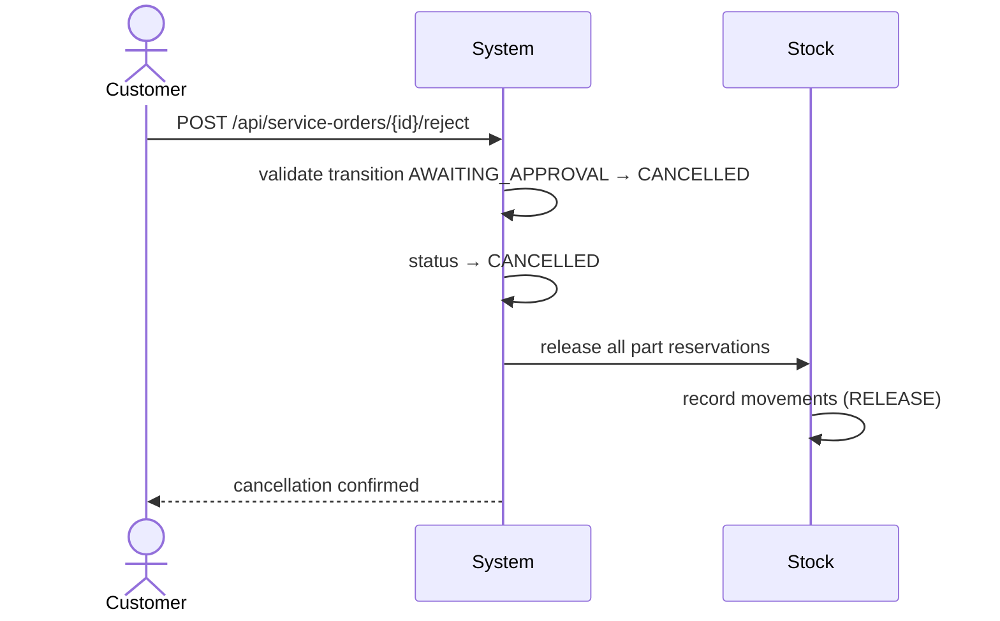
```mermaid
sequenceDiagram
    actor Customer
    participant System
    participant Stock

    Customer->>System: POST /api/service-orders/{id}/reject
    System->>System: validate transition AWAITING_APPROVAL → CANCELLED
    System->>System: status → CANCELLED
    System->>Stock: release all part reservations
    Stock->>Stock: record movements (RELEASE)
    System-->>Customer: cancellation confirmed
```

---

## Story 11b — Mechanic Starts Execution

**Scenario:** The mechanic is notified that the budget was approved and explicitly starts execution. The system confirms the order is in IN_EXECUTION status.

### Steps

```
1. Attendant     → notifies            → Mechanic                   → that budget was approved
2. Mechanic      → starts              → Execution                  → in System
3. System        → confirms            → Service Order is IN_EXECUTION → to Mechanic
4. Mechanic      → receives            → Service Order details       → from System
```

### Sequence Diagram

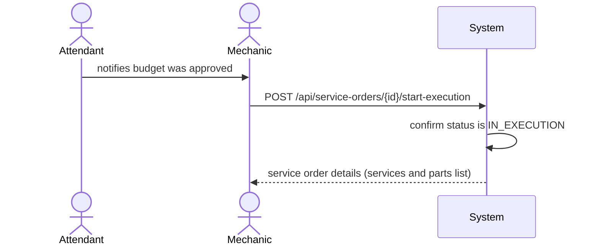
```mermaid
sequenceDiagram
    actor Attendant
    actor Mechanic
    participant System

    Attendant->>Mechanic: notifies budget was approved
    Mechanic->>System: POST /api/service-orders/{id}/start-execution
    System->>System: confirm status is IN_EXECUTION
    System-->>Mechanic: service order details (services and parts list)
```

---

## Story 12 — Service Execution

**Scenario:** With the budget approved, the mechanic executes the services and confirms part usage. The service order is completed.

### Steps

```
1. Mechanic      → starts              → Execution                  → in System
2. System        → confirms            → Status is IN_EXECUTION      → to Mechanic
3. Mechanic      → executes            → Service                    → on Vehicle
4. System        → marks               → Service item as done       → in Service Order
5. Mechanic      → confirms            → Part usage                 → in System
6. System        → deducts             → Part quantity              → from Stock
7. System        → records             → Stock Movement (OUTBOUND)  → in Database
8. Mechanic      → completes           → Service Order              → in System
9. System        → transitions         → Service Order status        → to COMPLETED
```

### Sequence Diagram

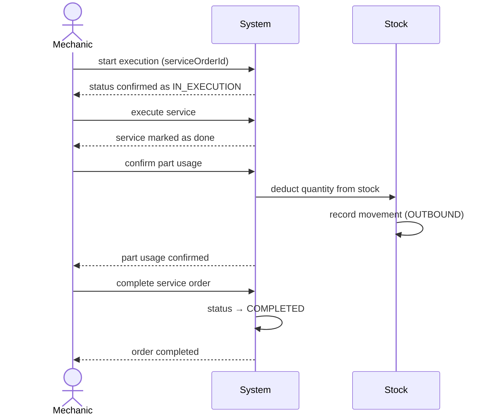
```mermaid
sequenceDiagram
    actor Mechanic
    participant System
    participant Stock

    Mechanic->>System: start execution (serviceOrderId)
    System-->>Mechanic: status confirmed as IN_EXECUTION

    Mechanic->>System: execute service
    System-->>Mechanic: service marked as done

    Mechanic->>System: confirm part usage
    System->>Stock: deduct quantity from stock
    Stock->>Stock: record movement (OUTBOUND)
    System-->>Mechanic: part usage confirmed

    Mechanic->>System: complete service order
    System->>System: status → COMPLETED
    System-->>Mechanic: order completed
```

---

## Story 13 — Vehicle Delivery

**Scenario:** The service is complete. The attendant registers the vehicle delivery to the customer.

### Steps

```
1. Customer      → arrives at          → Shop                       → to pick up Vehicle
2. Attendant     → retrieves           → Service Order details      → from System
3. System        → returns             → Service Order (COMPLETED)  → to Attendant
4. Attendant     → registers           → Vehicle delivery           → in System
5. System        → validates           → Transition COMPLETED → DELIVERED
6. System        → records             → Delivery timestamp          → in Database
7. System        → transitions         → Service Order status        → to DELIVERED
8. Attendant     → returns             → Vehicle                    → to Customer
```

### Sequence Diagram

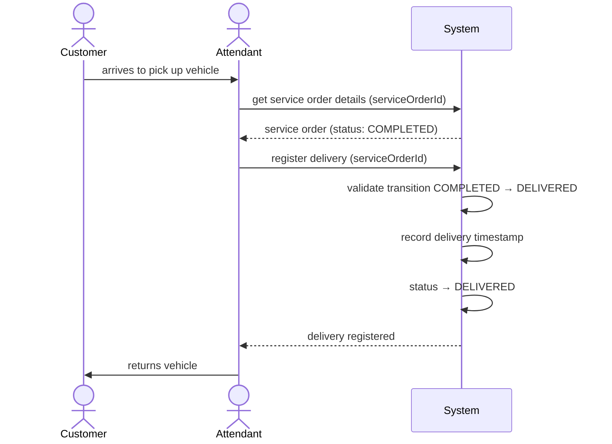
```mermaid
sequenceDiagram
    actor Customer
    actor Attendant
    participant System

    Customer->>Attendant: arrives to pick up vehicle
    Attendant->>System: get service order details (serviceOrderId)
    System-->>Attendant: service order (status: COMPLETED)
    Attendant->>System: register delivery (serviceOrderId)
    System->>System: validate transition COMPLETED → DELIVERED
    System->>System: record delivery timestamp
    System->>System: status → DELIVERED
    System-->>Attendant: delivery registered
    Attendant->>Customer: returns vehicle
```

---

## Story 14 — Customer Status Query (Public)

**Scenario:** A customer wants to check the progress of their vehicle repair without logging in.

### Steps

```
1. Customer      → queries             → Service Order status        → via API (no login)
2. System        → retrieves           → Service Order               → from Database
3. System        → returns             → Current status + summary    → to Customer
```

### Sequence Diagram

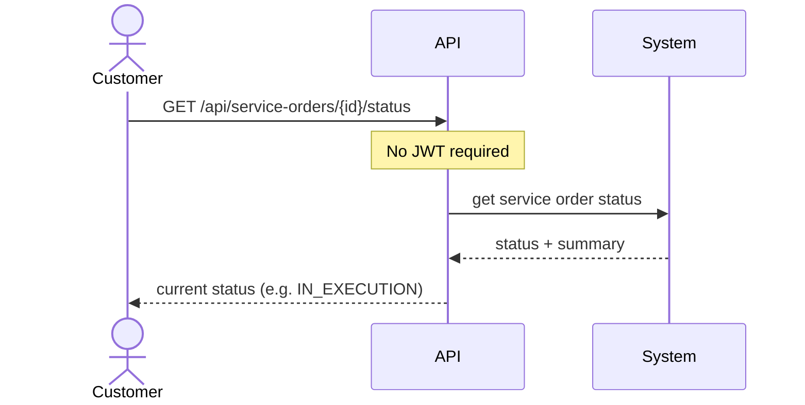
```mermaid
sequenceDiagram
    actor Customer
    participant API
    participant System

    Customer->>API: GET /api/service-orders/{id}/status
    Note over API: No JWT required
    API->>System: get service order status
    System-->>API: status + summary
    API-->>Customer: current status (e.g. IN_EXECUTION)
```

---

## Story 15 — Part Registration

**Scenario:** An administrator registers a new part in the catalog.

### Steps

```
1. Admin         → registers           → Part (code, name, price)   → in System
2. System        → validates           → Part data                  → (unique code, positive price)
3. System        → saves               → Part                       → in Database
4. System        → confirms            → Part registered            → to Admin
```

### Sequence Diagram

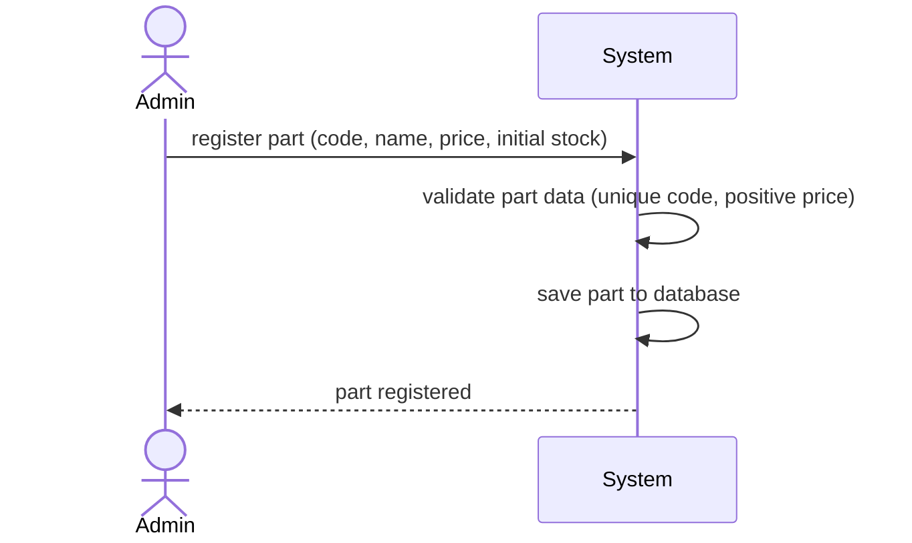
```mermaid
sequenceDiagram
    actor Admin
    participant System

    Admin->>System: register part (code, name, price, initial stock)
    System->>System: validate part data (unique code, positive price)
    System->>System: save part to database
    System-->>Admin: part registered
```

---

## Story 16 — Stock Replenishment

**Scenario:** An administrator replenishes the stock for an existing part.

### Steps

```
1. Admin         → replenishes         → Stock                      → for Part
2. System        → updates             → Stock quantity              → for Part
3. System        → records             → Stock Movement (INBOUND)   → in Database
4. System        → confirms            → Stock updated              → to Admin
```

### Sequence Diagram

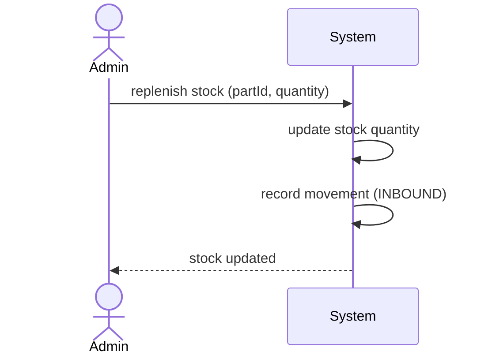
```mermaid
sequenceDiagram
    actor Admin
    participant System

    Admin->>System: replenish stock (partId, quantity)
    System->>System: update stock quantity
    System->>System: record movement (INBOUND)
    System-->>Admin: stock updated
```

---

## Actor Summary

| Actor | Role | Key Interactions |
|---|---|---|
| **Customer** | Vehicle owner | Arrives, approves/rejects budget, queries status, picks up vehicle |
| **Attendant** | Front-desk staff | Identifies customer/vehicle, creates service order, adds items, sends budget, registers delivery |
| **Mechanic** | Shop technician | Starts diagnosis, adds discovered items, executes services, confirms part usage, completes order |
| **Administrator** | System manager | Manages parts catalog, replenishes stock |
| **System** | Internal automations | Validates data, transitions status, calculates budget, manages stock movements |

---

## Work Objects Summary

| Work Object | Description |
|---|---|
| **Customer** | Person identified by CPF/CNPJ |
| **Vehicle** | Car identified by license plate |
| **Service Order** | Central document linking customer, vehicle, services, parts, and budget |
| **Service** | Technical job to be performed |
| **Part** | Physical item or consumable with stock control |
| **Budget** | Calculated cost sent for customer approval |
| **Stock Movement** | Record of every stock change (inbound, outbound, reservation, release) |

---

## Story Map

| Story | Actor | Scenario |
|---|---|---|
| 1 | Attendant | Existing customer identified |
| 2 | Attendant | New customer registered |
| 3 | Attendant | Existing vehicle identified |
| 4 | Attendant | New vehicle registered |
| 5 | Attendant | Service order created — parts in stock |
| 6 | Attendant | Part added — insufficient stock warning |
| 7 | Mechanic | Diagnosis started — no new items |
| 8 | Mechanic | Diagnosis — new items discovered |
| 8b | Mechanic + Attendant | Diagnosis closed — budget requested and sent |
| 9 | Attendant | Budget generated and sent (standalone) |
| 10 | Customer | Budget approved |
| 11 | Customer | Budget rejected — order cancelled |
| 11b | Mechanic | Mechanic starts execution after approval |
| 12 | Mechanic | Services executed — order completed |
| 13 | Attendant | Vehicle delivered to customer |
| 14 | Customer | Status queried without login |
| 15 | Admin | Part registered in catalog |
| 16 | Admin | Stock replenished |
