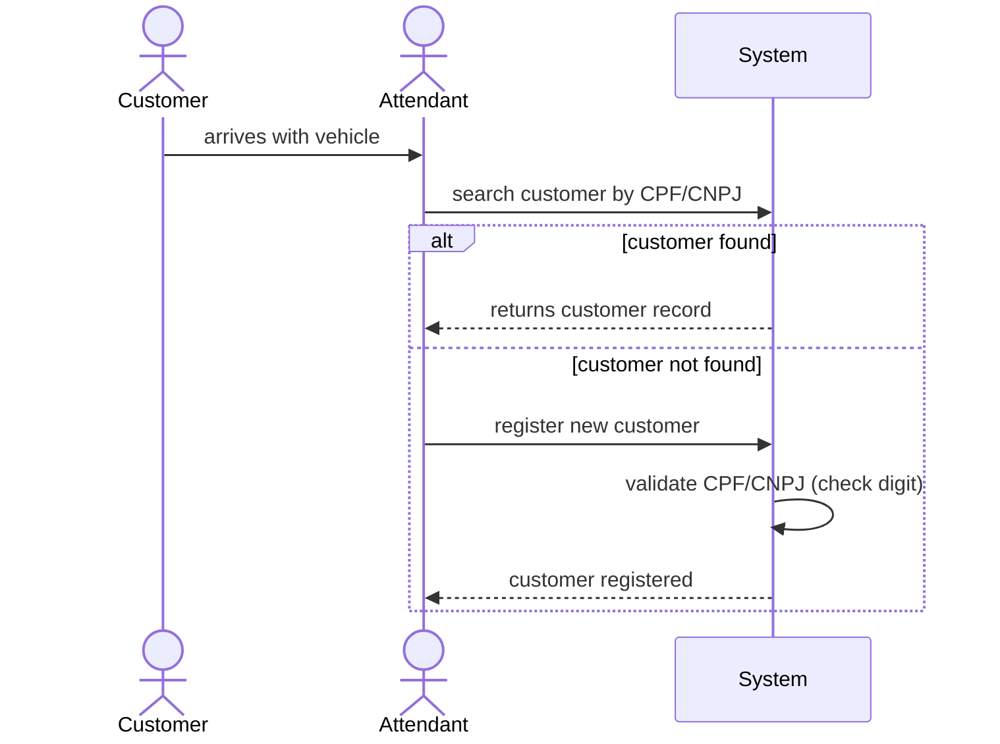
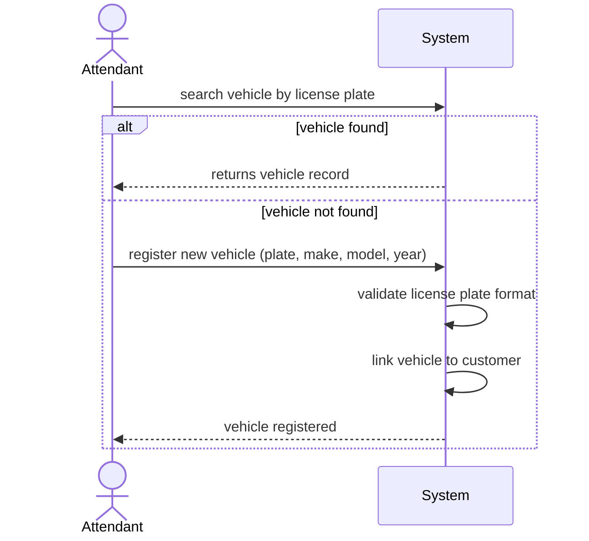
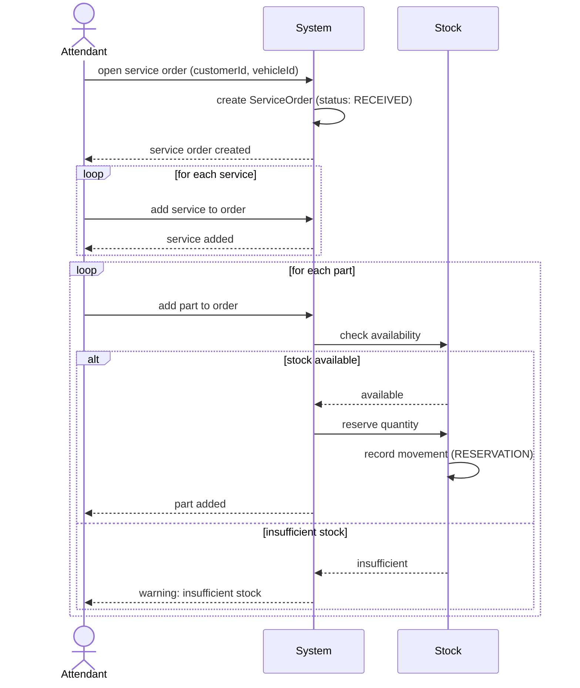
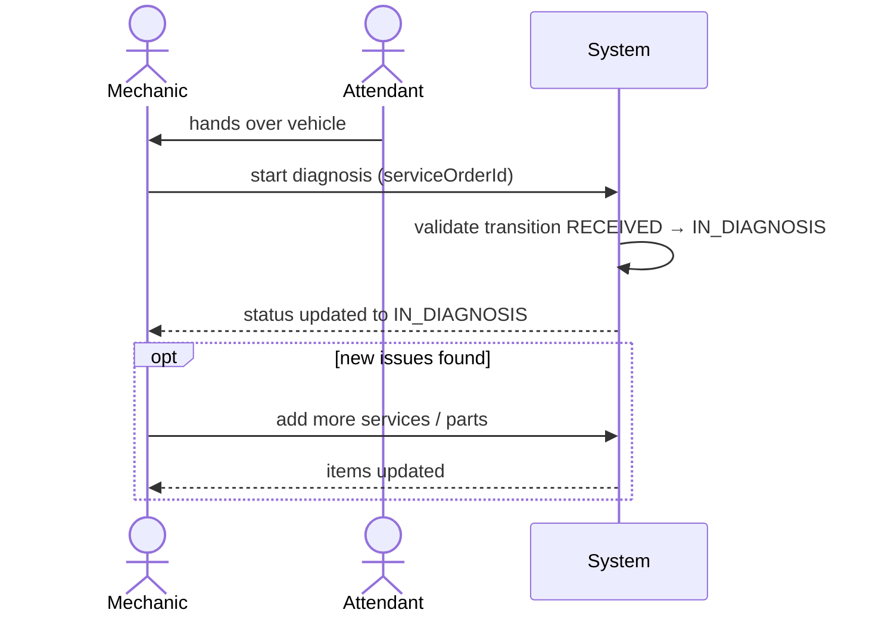
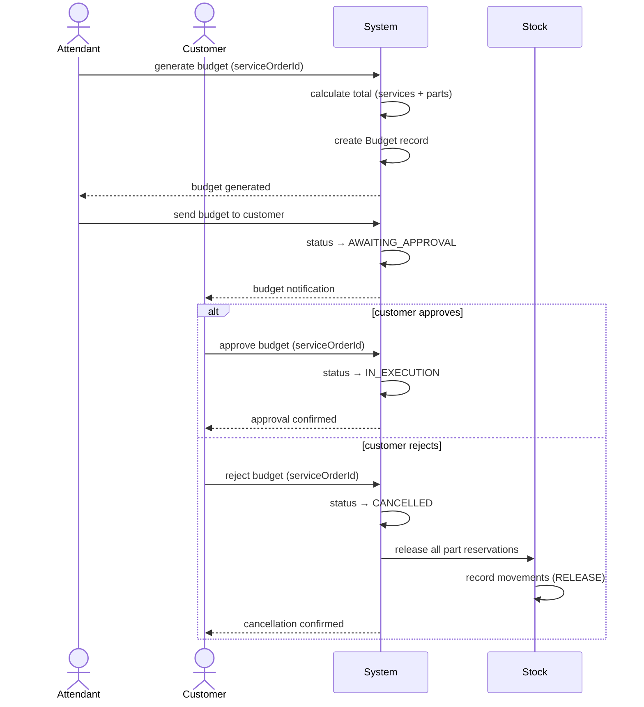
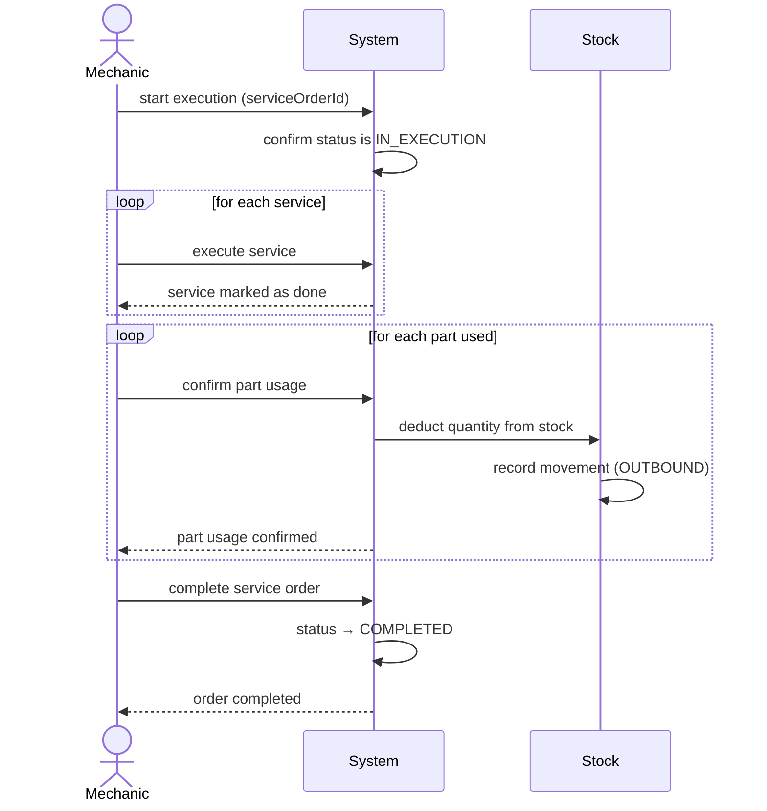
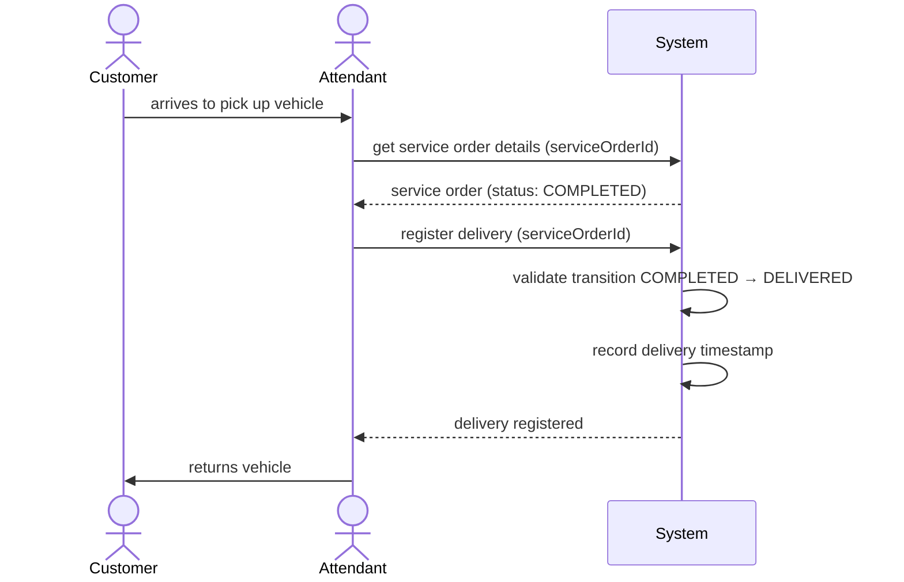
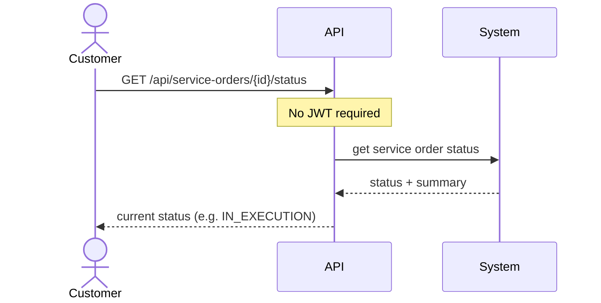
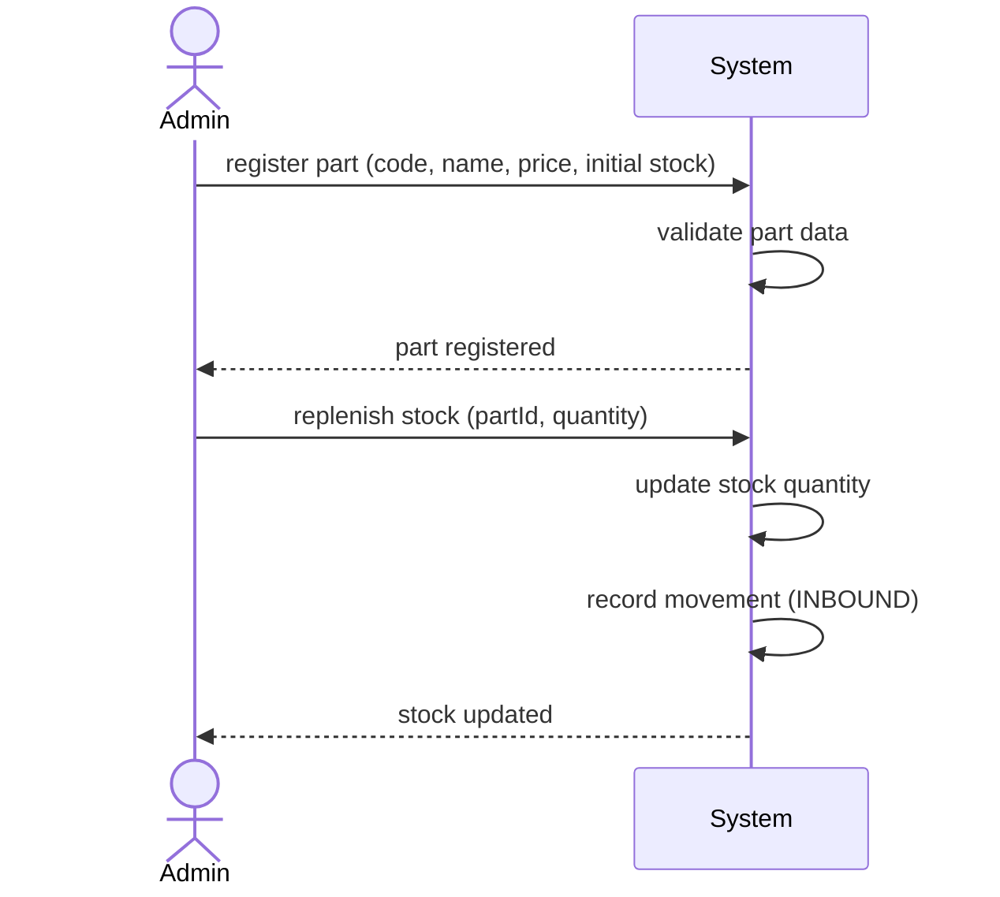

# Domain Storytelling — Mechanics Software

Domain Storytelling captures how the business works through stories told by domain experts. Each story follows the notation:

```
[Actor] → [verb] → [work object] → (to/at/in) [actor or system]
```

Stories are numbered step-by-step and accompanied by a sequence diagram.

---

## Story 1 — Customer Identification

**Scenario:** A customer arrives at the shop. The attendant needs to identify them before opening a service order.

### Steps

```
1. Customer      → arrives at          → Shop (with Vehicle)   → at Attendant
2. Attendant     → searches for        → Customer (by CPF/CNPJ) → in System
3. System        → returns             → Customer record        → to Attendant
   [if not found]
4. Attendant     → registers           → Customer data          → in System
5. System        → validates           → CPF / CNPJ             → (check digit algorithm)
6. System        → saves               → Customer               → in Database
7. System        → confirms            → Customer registration  → to Attendant
```

### Sequence Diagram



---

## Story 2 — Vehicle Identification

**Scenario:** After identifying the customer, the attendant locates or registers the vehicle.

### Steps

```
1. Attendant     → searches for        → Vehicle (by license plate) → in System
2. System        → returns             → Vehicle record              → to Attendant
   [if not found]
3. Attendant     → registers           → Vehicle data                → in System
4. System        → validates           → License plate format        → (Mercosul / legacy)
5. System        → links               → Vehicle                     → to Customer
6. System        → confirms            → Vehicle registration        → to Attendant
```

### Sequence Diagram



---

## Story 3 — Service Order Creation

**Scenario:** With customer and vehicle identified, the attendant opens a service order and adds services and parts.

### Steps

```
1. Attendant     → opens               → Service Order              → in System
2. System        → creates             → Service Order              → with status RECEIVED
3. System        → links               → Customer + Vehicle         → to Service Order
4. Attendant     → adds                → Services (requested)       → to Service Order
5. Attendant     → adds                → Parts / Supplies needed    → to Service Order
6. System        → checks              → Stock availability          → for each Part
7. System        → reserves            → Parts                      → in Stock
8. System        → records             → Stock Movement (RESERVATION) → in Database
```

### Sequence Diagram



---

## Story 4 — Diagnosis

**Scenario:** A mechanic receives the vehicle and begins the technical evaluation.

### Steps

```
1. Mechanic      → receives            → Vehicle                    → from Attendant
2. Mechanic      → starts              → Diagnosis                  → in System
3. System        → transitions         → Service Order status        → to IN_DIAGNOSIS
4. Mechanic      → evaluates           → Vehicle                    → physically
5. Mechanic      → adds                → additional Services/Parts   → to Service Order
   (if new issues found during diagnosis)
6. System        → updates             → Service Order items         → in Database
```

### Sequence Diagram



---

## Story 5 — Budget Generation and Approval

**Scenario:** After diagnosis, the system calculates the budget and sends it to the customer for approval.

### Steps

```
1. Attendant     → requests            → Budget generation          → from System
2. System        → calculates          → Budget                     → from services + parts prices
3. System        → creates             → Budget record              → in Database
4. Attendant     → sends               → Budget                     → to Customer (via API)
5. System        → transitions         → Service Order status        → to AWAITING_APPROVAL
6. Customer      → reviews             → Budget                     → via API
   [if approved]
7. Customer      → approves            → Budget                     → via API
8. System        → transitions         → Service Order status        → to IN_EXECUTION
   [if rejected]
7. Customer      → rejects             → Budget                     → via API
8. System        → transitions         → Service Order status        → to CANCELLED
9. System        → releases            → Part reservations          → in Stock
10. System       → records             → Stock Movement (RELEASE)   → in Database
```

### Sequence Diagram



---

## Story 6 — Service Execution

**Scenario:** With the budget approved, the mechanic executes the services and confirms part usage.

### Steps

```
1. Mechanic      → receives            → Service Order (approved)   → from System
2. Mechanic      → executes            → Services                   → on Vehicle
3. Mechanic      → uses                → Parts                      → during execution
4. System        → deducts             → Parts                      → from Stock
5. System        → records             → Stock Movement (OUTBOUND)  → in Database
6. Mechanic      → completes           → Service Order              → in System
7. System        → transitions         → Service Order status        → to COMPLETED
```

### Sequence Diagram



---

## Story 7 — Vehicle Delivery

**Scenario:** The service is complete. The attendant registers the vehicle delivery to the customer.

### Steps

```
1. Customer      → comes to            → Shop                       → to pick up Vehicle
2. Attendant     → verifies            → Service Order              → in System
3. Attendant     → registers           → Vehicle delivery           → in System
4. System        → transitions         → Service Order status        → to DELIVERED
5. System        → records             → Delivery timestamp          → in Database
6. Attendant     → returns             → Vehicle                    → to Customer
```

### Sequence Diagram



---

## Story 8 — Customer Status Query (Public)

**Scenario:** A customer wants to check the progress of their vehicle repair without logging in.

### Steps

```
1. Customer      → queries             → Service Order status        → via API (no login)
2. System        → retrieves           → Service Order               → from Database
3. System        → returns             → Current status + summary    → to Customer
```

### Sequence Diagram



---

## Story 9 — Inventory Management

**Scenario:** An administrator manages the parts catalog and replenishes stock.

### Steps

```
1. Admin         → registers           → Part (code, name, price)   → in System
2. System        → validates           → Part data                  → (unique code, positive price)
3. System        → saves               → Part                       → in Database
4. Admin         → replenishes         → Stock                      → for Part
5. System        → updates             → Stock quantity              → for Part
6. System        → records             → Stock Movement (INBOUND)   → in Database
```

### Sequence Diagram



---

## Actor Summary

| Actor | Role | Key Interactions |
|---|---|---|
| **Customer** | Vehicle owner | Arrives, approves/rejects budget, queries status, picks up vehicle |
| **Attendant** | Front-desk staff | Identifies customer/vehicle, creates OS, adds items, sends budget, registers delivery |
| **Mechanic** | Shop technician | Starts diagnosis, executes services, confirms part usage, completes OS |
| **Administrator** | System manager | Manages parts catalog, replenishes stock, manages users |
| **System** | Internal automations | Validates data, transitions status, calculates budget, manages stock movements |

---

## Work Objects Summary

| Work Object | Description |
|---|---|
| **Customer** | Person identified by CPF/CNPJ |
| **Vehicle** | Car identified by license plate |
| **Service Order** | Central document linking customer, vehicle, services, parts, and budget |
| **Service** | Technical job to be performed |
| **Part / Supply** | Physical item with stock control |
| **Budget** | Calculated cost sent for customer approval |
| **Stock Movement** | Record of every stock change (inbound, outbound, reservation, release) |
