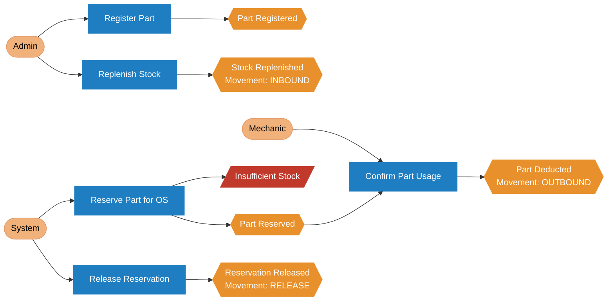
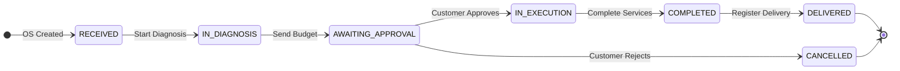

# Event Storming — Mechanics Software

> **Miro Board:** [View interactive Event Storming board](https://miro.com/app/board/uXjVGyCZXBU=/?share_link_id=603303836436)

## Legend

| Symbol | Type | Description |
|---|---|---|
| `[EVT]` | Domain Event | Something that happened in the system (orange) |
| `[CMD]` | Command | An intent/action that triggers an event (blue) |
| `[AGG]` | Aggregate | The entity that handles the command (yellow) |
| `[POL]` | Policy / Rule | An automatic reaction to an event (purple) |
| `[ACT]` | Actor | Who triggers the command (beige) |
| `[HOT]` | Hot Spot | An open question or problem (red) |

---

## Flow 1 — Service Order Creation and Tracking (Overview)

```mermaid
flowchart LR
    classDef event fill:#E8902B,color:#fff,stroke:#E8902B
    classDef command fill:#1F7EC2,color:#fff,stroke:#1F7EC2
    classDef aggregate fill:#D4AC0D,color:#000,stroke:#D4AC0D
    classDef policy fill:#7D3C98,color:#fff,stroke:#7D3C98
    classDef actor fill:#F0B27A,color:#000,stroke:#E59866
    classDef hotspot fill:#C0392B,color:#fff,stroke:#C0392B

    A1([Customer]):::actor --> C1[Identify Customer]:::command
    C1 --> E1{{Customer Identified}}:::event
    C1 --> C1b[Register Customer]:::command
    C1b --> E1b{{Customer Registered}}:::event

    E1 --> C2[Locate Vehicle]:::command
    E1b --> C2
    C2 --> E2{{Vehicle Located}}:::event
    C2 --> C2b[Register Vehicle]:::command
    C2b --> E2b{{Vehicle Registered}}:::event

    A2([Attendant]):::actor --> C3[Open Service Order]:::command
    E2 --> C3
    E2b --> C3
    C3 --> E3{{OS Created\nstatus: RECEIVED}}:::event

    E3 --> C7[Start Diagnosis]:::command
    C7 --> E7{{Diagnosis Started\nstatus: IN_DIAGNOSIS}}:::event

    E7 --> C4[Add Services / Parts]:::command
    C4 --> E4{{Items Added to OS\navailability: AVAILABLE}}:::event
    C4 --> H1[/Insufficient Stock:\nAdd as UNAVAILABLE + alert attendant/]:::hotspot
    H1 --> E4b{{Part Added as UNAVAILABLE}}:::event

    E4 --> C5[Generate Budget]:::command
    E4b --> C5
    C5 --> E5{{Budget Generated}}:::event
    E5 --> C6[Send Budget]:::command
    C6 --> E6{{Budget Sent\nstatus: AWAITING_APPROVAL}}:::event

    A3([Customer]):::actor --> C7[Approve Budget]:::command
    A3 --> C8[Reject Budget]:::command
    E6 --> C7
    E6 --> C8
    C7 --> E7{{Budget Approved\nstatus: IN_EXECUTION}}:::event
    C8 --> E8{{Budget Rejected\nstatus: CANCELLED}}:::event

    A4([Mechanic]):::actor --> C9[Complete Services]:::command
    E7 --> C9
    C9 --> E9{{OS Completed}}:::event
    E9 --> C10[Register Delivery]:::command
    C10 --> E10{{Vehicle Delivered\nstatus: DELIVERED}}:::event
```



## Flow 1 — Service Order Creation and Tracking (Detailed)

### Step 1 — Customer Identification

```
[ACT] Customer
  |
  v
[CMD] Identify customer by CPF/CNPJ
  |
  v
[AGG] Customer
  |
  +-- found     --> [EVT] Customer Identified
  |
  +-- not found --> [CMD] Register Customer
                         |
                         v
                    [POL] CPF/CNPJ must be valid (check digit algorithm)
                    [POL] Email must have a valid format
                         |
                         v
                    [EVT] Customer Registered
```

---

### Step 2 — Vehicle Identification

```
[ACT] Attendant
  |
  v
[CMD] Locate vehicle by license plate
  |
  v
[AGG] Vehicle
  |
  +-- found     --> [EVT] Vehicle Located
  |
  +-- not found --> [CMD] Register Vehicle
                         |
                         v
                    [POL] License plate must be valid (Mercosul ABC1D23 or legacy ABC-1234)
                    [POL] Vehicle must be linked to an existing customer
                         |
                         v
                    [EVT] Vehicle Registered
```

---

### Step 3 — Service Order Opening

```
[ACT] Attendant
  |
  v
[CMD] Open Service Order
  |
  v
[AGG] ServiceOrder
  |
  v
[POL] Initial status must be RECEIVED
[POL] OS must reference a valid customer and vehicle
  |
  v
[EVT] Service Order Created (status: RECEIVED)
```

---

### Step 4 — Diagnosis

```
[ACT] Mechanic
  |
  v
[CMD] Start Diagnosis
  |
  v
[AGG] ServiceOrder
  |
  v
[POL] Valid transition: RECEIVED --> IN_DIAGNOSIS
  |
  v
[EVT] Diagnosis Started
[EVT] Service Order Status Updated to IN_DIAGNOSIS
```

> Diagnosis may uncover services and parts needed — composition (Step 5) follows.

---

### Step 5 — Service Order Composition

```
[ACT] Attendant / Mechanic
  |
  +-- [CMD] Add Service to OS
  |         |
  |         v
  |    [AGG] ServiceOrder
  |         |
  |         v
  |    [POL] OS must be in IN_DIAGNOSIS status
  |         |
  |         v
  |    [EVT] Service Added to OS (availability: AVAILABLE)
  |
  +-- [CMD] Add Part to OS
            |
            v
       [AGG] ServiceOrder
            |
            v
       [POL] OS must be in IN_DIAGNOSIS status
       [POL] Check stock availability
            |
            +-- available     --> [EVT] Part Added to OS (availability: AVAILABLE)
            |                    [EVT] Part Reserved in Stock
            |
            +-- not available --> [POL] Add part as UNAVAILABLE, alert attendant
                                  [EVT] Part Added to OS (availability: UNAVAILABLE)
                                  [NOTE] No stock reservation for unavailable parts
                                  [NOTE] Attendant notified — customer decides at budget approval
```

> **Resolved HOT SPOT #2:** Insufficient stock does NOT block the OS. The part is added
> with `availability: UNAVAILABLE` and excluded from the budget total. The customer
> can approve the budget knowing some parts are missing, and decide whether to proceed.

---

### Step 6 — Budget Generation and Sending

```
[ACT] System / Attendant
  |
  v
[CMD] Generate Budget
  |
  v
[AGG] ServiceOrder
  |
  v
[POL] OS must have at least one AVAILABLE service or part
[POL] Total = sum(service price * qty | AVAILABLE only)
            + sum(part price * qty    | AVAILABLE only)
[POL] UNAVAILABLE items are listed in the budget but excluded from the total
[POL] Budget is created as a child of the OS — not a separate aggregate
  |
  v
[EVT] Budget Generated

  |
  v
[CMD] Send Budget to Customer
  |
  v
[AGG] ServiceOrder
  |
  v
[POL] Status automatically changes to AWAITING_APPROVAL
  |
  v
[EVT] Budget Sent to Customer
[EVT] Service Order Status Updated to AWAITING_APPROVAL
```

---

### Step 7 — Approval or Rejection

```
[ACT] Customer
  |
  +-- [CMD] Approve Budget
  |         |
  |         v
  |    [AGG] ServiceOrder
  |         |
  |         v
  |    [POL] Status changes to IN_EXECUTION
  |         |
  |         v
  |    [EVT] Budget Approved
  |    [EVT] Service Order Status Updated to IN_EXECUTION
  |
  +-- [CMD] Reject Budget
            |
            v
       [AGG] ServiceOrder
            |
            v
       [POL] Status changes to CANCELLED
       [POL] All stock reservations must be released
            |
            v
       [EVT] Budget Rejected
       [EVT] Service Order Status Updated to CANCELLED
       [EVT] Part Reservations Released
```

---

### Step 8 — Execution

```
[ACT] Mechanic
  |
  v
[CMD] Execute Services
  |
  v
[AGG] ServiceOrder
  |
  v
[POL] OS must be in IN_EXECUTION status
[POL] When a part is used, deduct from stock
  |
  v
[EVT] Service Executed
[EVT] Part Used in OS
[EVT] Part Deducted from Stock
[EVT] Stock Movement Recorded
```

---

### Step 9 — Completion and Delivery


```
[ACT] Mechanic
  |
  v
[CMD] Complete Service Order
  |
  v
[AGG] ServiceOrder
  |
  v
[POL] Valid transition: IN_EXECUTION --> COMPLETED
  |
  v
[EVT] Service Order Completed
[EVT] Service Order Status Updated to COMPLETED

  |
  v
[ACT] Attendant
  |
  v
[CMD] Register Vehicle Delivery
  |
  v
[AGG] ServiceOrder
  |
  v
[POL] Valid transition: COMPLETED --> DELIVERED
  |
  v
[EVT] Vehicle Delivered to Customer
[EVT] Service Order Status Updated to DELIVERED
```

---

## Flow 2 — Parts and Inventory Management (Overview)



## Flow 2 — Parts and Inventory Management (Detailed)

### Part Registration

```
[ACT] Administrator
  |
  v
[CMD] Register Part
  |
  v
[AGG] Part
  |
  v
[POL] Part code must be unique
[POL] Unit price must be positive
[POL] Initial stock quantity >= 0
  |
  v
[EVT] Part Registered

  |
  v
[CMD] Update Part
  |
  v
[EVT] Part Updated
```

---

### Stock Movements

```
[ACT] Administrator / System
  |
  +-- [CMD] Replenish Stock
  |         |
  |         v
  |    [AGG] Part
  |         |
  |         v
  |    [POL] Quantity must be positive
  |         |
  |         v
  |    [EVT] Stock Replenished
  |    [EVT] Stock Movement Recorded (type: INBOUND)
  |
  +-- [CMD] Reserve Part for OS
  |         |
  |         v
  |    [AGG] Part
  |         |
  |         v
  |    [POL] Available quantity must be >= requested quantity
  |         |
  |         +-- ok          --> [EVT] Part Reserved for OS
  |         |                   [EVT] Stock Movement Recorded (type: RESERVATION)
  |         |
  |         +-- insufficient --> [EVT] Insufficient Stock Identified
  |                              [HOT] Block addition to OS or allow with warning?
  |
  +-- [CMD] Confirm Part Usage (after execution)
  |         |
  |         v
  |    [AGG] Part
  |         |
  |         v
  |    [POL] Reservation must exist for the OS
  |    [POL] Stock cannot go negative
  |         |
  |         v
  |    [EVT] Part Usage Confirmed
  |    [EVT] Part Deducted from Stock
  |    [EVT] Stock Movement Recorded (type: OUTBOUND)
  |
  +-- [CMD] Release Part Reservation (when OS is cancelled)
            |
            v
       [AGG] Part
            |
            v
       [POL] Reservation must exist for the OS
            |
            v
       [EVT] Part Reservation Released
       [EVT] Stock Movement Recorded (type: RELEASE)
```

---

## State Machine — Service Order Status



### Valid Transitions

| From | To | Trigger |
|---|---|---|
| `RECEIVED` | `IN_DIAGNOSIS` | Mechanic starts diagnosis |
| `IN_DIAGNOSIS` | `AWAITING_APPROVAL` | Budget sent to customer |
| `AWAITING_APPROVAL` | `IN_EXECUTION` | Customer approves budget |
| `AWAITING_APPROVAL` | `CANCELLED` | Customer rejects budget |
| `IN_EXECUTION` | `COMPLETED` | Mechanic completes all services |
| `COMPLETED` | `DELIVERED` | Attendant registers vehicle pickup |

Any other transition must throw `InvalidStatusTransitionException`.

---

## Hot Spots

| # | Description | Status | Resolution |
|---|---|---|---|
| 1 | Diagnosis may uncover new services — how to reopen OS composition? | ✅ Resolved | Diagnosis (Step 4) now precedes composition (Step 5). Items can be added while status is IN_DIAGNOSIS. |
| 2 | Insufficient stock when adding a part — block or warn? | ✅ Resolved | Add part as `UNAVAILABLE`, alert attendant. No stock reservation. Excluded from budget total. Customer decides at approval. |
| 3 | Customer queries status without authentication — how to identify them? | Open | Public endpoint `GET /service-orders/{id}/status` — no auth required |
| 4 | Partial item cancellation on an OS before approval | Open | Low priority for Phase 1 |

---

## System Actors

| Actor | Description | Permissions |
|---|---|---|
| **Customer** | Vehicle owner | Query OS status (public), approve/reject budget |
| **Attendant** | Front-desk staff | Create OS, register items, send budget, register delivery |
| **Mechanic** | Shop technician | Start diagnosis, start execution, complete OS |
| **Administrator** | System manager | Full access: CRUDs, reports, users |
| **System** | Internal automations | Generate budget, update status, record stock movements |

---

## Changelog

### 2026-03-14 — Domain review by team

**1. Step ordering fix — Diagnosis before Composition**
- Previous flow: OS Created → Add Items → Diagnosis
- Corrected flow: OS Created → Diagnosis (IN_DIAGNOSIS) → Add Items → Generate Budget
- Rationale: the mechanic must evaluate the vehicle first before knowing which services and parts are needed. Composition only makes sense after diagnosis.

**2. PartItem availability — AVAILABLE / UNAVAILABLE**
- Previous behaviour: insufficient stock was an open hot spot (block or warn?)
- New behaviour: when stock is insufficient, the part is added to the OS with `availability: UNAVAILABLE`. The attendant is alerted. No stock reservation is made for unavailable parts.
- Unavailable parts are listed in the budget but **excluded from the total**.
- The customer sees the full picture at approval time and decides whether to proceed knowing some parts are missing.

**3. Budget calculation policy updated**
- Previous: `Total = sum(service price * qty) + sum(part price * qty)`
- Updated: `Total = sum(AVAILABLE service price * qty) + sum(AVAILABLE part price * qty)`
- UNAVAILABLE items appear in the budget document for transparency but do not affect the total.

**4. OS composition restriction tightened**
- Previous: items could be added while status is `RECEIVED` or `IN_DIAGNOSIS`
- Updated: items can only be added while status is `IN_DIAGNOSIS` (diagnosis must happen first)
